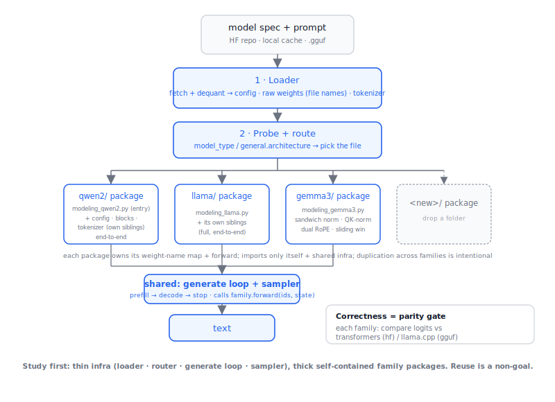

# lollm — a study-first LLM inference engine

A small, readable inference engine for **studying how LLMs (and related models) run
inference**. A thin **loader + router**, a shared **generate loop**, and
self-contained **family packages** — currently **qwen2 · qwen3 · gemma2**, from HF
safetensors **and** GGUF. PyTorch is the only dependency for the actual model math.

## Vision

1. **Study-first.** The point is to *read and understand* LLM inference end to end —
   load, tokenize, the forward pass, sampling, quantized weights. Clarity for a
   learner beats every other concern.
2. **PyTorch-only for the model.** All LLM-related math (the architecture, attention,
   norms, RoPE, the generate loop) depends on **PyTorch alone** — no `transformers`
   modeling, no `llama.cpp`. We parse GGUF and dequantize ourselves (numpy) and build
   each architecture from `nn.Module` primitives. (`huggingface_hub` only *downloads*
   files — that's fine, it never touches the forward pass.) **Known wart:** the
   safetensors path still leans on `transformers.AutoTokenizer` for tokenization; we
   plan to drop that dependency later (the GGUF path already tokenizes on its own).
3. **Hard-fail, never guess.** When something is unknown or unverified — a missing
   `model_type`, an unmapped weight name, an unconfirmed GGUF key — we **raise loudly**
   instead of falling back to a plausible default. A crash tells us exactly what to
   fix; a silent guess emits confident garbage.
4. **Readable over optimized.** Prefer the clear implementation to the fast one.
   Duplication across families is intentional; each architecture reads on its own.
   We optimize only when it doesn't cost clarity (e.g. streaming weight load).
5. **Validate against transformers.** We prove each implementation against
   `transformers` `AutoModelForCausalLM` as the reference: `compare_logits.py` runs
   our model and the reference on the same prompt and checks they predict the same
   next token (same argmax + cosine ≈ 1). **If you use this repo, run
   `compare_logits.py` to validate any model/architecture before trusting its
   output** — it's how we catch a wrong RoPE, norm, or weight map.

## Install

Dependencies live in `pyproject.toml`. Use a **virtual environment** so this stays
isolated from your system Python.

```bash
# 1. create + activate a venv (Python ≥ 3.10)
python3 -m venv venv
source venv/bin/activate          # Windows: venv\Scripts\activate

# 2. install the project (reads dependencies from pyproject.toml)
pip install -e .                  # editable: src/ changes take effect immediately

# (when you're done) deactivate
```

`pip install -e .` pulls in torch, numpy, safetensors, transformers,
huggingface_hub, regex, and jinja2 (the floors pinned in `pyproject.toml`) and exposes
two console scripts — `lollm` (run) and `compare` (parity gate). The `python src/...`
commands below work the same; the scripts are just shortcuts.

> **Note:** `pyproject.toml` pins dependency *floors* known to work. For an exact,
> reproducible environment, freeze your versions: `pip freeze > requirements.lock`.

### Hardware / backend

> ⚠️ **Currently validated only on Apple Silicon (Mac M-series, MPS).** The code is
> written against the generic `torch`/`nn` API and *should* run on CUDA and CPU, but
> those paths haven't been verified end-to-end yet. Treat them as untested.

The PyTorch **version** (`torch>=2.2`) and the **backend** (CPU / CUDA / ROCm / MPS)
are separate: the version is pinned here, but the backend is chosen at *install time*
by which wheel index you pull from — `pyproject.toml` can't pick it for you (there's
no way to detect a GPU from a dependency spec). So install `torch` first for your
hardware, then `pip install -e .` (which leaves your chosen build in place):

```bash
# macOS / Apple Silicon — the default wheel already includes CPU + MPS (the tested path)
pip install torch

# NVIDIA (CUDA) — pick the tag matching your driver; see the selector linked below
pip install torch --index-url https://download.pytorch.org/whl/cu126

# AMD (ROCm, Linux) — exposes the device as "cuda" in code
pip install torch --index-url https://download.pytorch.org/whl/rocm7.1

# CPU-only (any OS)
pip install torch --index-url https://download.pytorch.org/whl/cpu

pip install -e .                  # then the rest of the deps
```

Compute tags (`cu126`, `cu128`, `rocm7.1`, …) change over time — the official
[PyTorch Get Started selector](https://pytorch.org/get-started/locally/) always
generates the current command for your OS + CUDA version. (For a locked, per-backend
setup, [uv](https://docs.astral.sh/uv/guides/integration/pytorch/) can declare the
torch index in `pyproject.toml` with platform markers.)

**Verify what you got.** `run.py` auto-detects the device (cuda → mps → cpu) and the
matching dtype, so check it landed where you expect:

```python
import torch
print(torch.__version__)                  # the +cuXYZ / +cpu suffix tells you the backend
print(torch.backends.mps.is_available())  # Apple Metal (the validated path)
print(torch.cuda.is_available())          # NVIDIA / ROCm
```

`run.py` already maps each backend to its fast dtype — **bfloat16** on CUDA,
**float16** on MPS, **float32** on CPU — so once the right wheel is installed the
engine adapts automatically.

## Quickstart

```bash
# safetensors (HF repo / local dir)
python src/run.py --model Qwen/Qwen2.5-0.5B-Instruct --prompt "Explain RoPE in one line."
python src/run.py --model ./local/qwen2/dir --prompt "Hi" --temperature 0   # greedy

# GGUF (local .gguf or repo:QUANT — downloaded + dequantized)
python src/run.py --model Qwen/Qwen2.5-0.5B-Instruct-GGUF:Q4_K_M --prompt "Hi"
python src/run.py --model ./qwen2.5-0.5b-instruct-q4_k_m.gguf   --prompt "Hi"

python src/compare_logits.py --model Qwen/Qwen2.5-0.5B-Instruct             # parity gate (safetensors)
```

## Design at a glance



## Layout

```
src/
├── loader.py         # SHARED: fetch (HF/cache/gguf) → raw config + weights (file names) + tokenizer
├── router.py         # SHARED: probe model_type → route to model (fail loud)
├── generate.py       # SHARED: the one loop (prefill → decode → stop) + sampler
├── gguf_reader.py    # SHARED: parse GGUF (metadata + tensor table + raw bytes)
├── dequant.py        # SHARED: dequantize GGUF blocks (Q4_K, Q6_K, Q5_0, …)
├── tokenization.py   # SHARED: uniform tokenizer — HFTokenizer + GGUFTokenizer (embedded BPE)
├── models.py         # registry: Family record + register/get; imports each family (e.g. `import qwen2`)
├── run.py            # CLI: loader → router → model.load → generate
├── compare_logits.py # parity gate vs transformers
└── qwen2/                       # one self-contained family package
    ├── __init__.py              # manifest: MODEL_TYPES · DEFAULTS · register(load)
    ├── config.py                # Qwen2Config — parse config.json (hf) / metadata (gguf)
    ├── blocks.py                # small components: RMSNorm · RoPE · attention · MLP
    ├── modeling_qwen2.py        # architecture: DecoderLayer + Qwen2Model + forward
    └── weights.py               # the weight-name seam (maps) + load (checkpoint → model)
```

A family package imports only its own siblings (`config`, `blocks`) + the shared
registry — never another family. Adding a model = drop a `<family>/` package + add
`import <family>` to `models.py`.

See **[CONVENTIONS.md](./CONVENTIONS.md)** for the family pattern we follow (file
roles, the self-containment rule, and the numbered-step `forward` narration) so
every architecture reads the same way. `qwen2/` is the reference to copy.

## The flow

```
spec ─► loader (raw config + weights by file names + tokenizer)
     ─► router (model_type → qwen2 family)
     ─► qwen2.load(raw_config, weights, fmt)   ← family builds the model + maps its own weight names
     ─► shared generate loop (calls model.forward(ids, past)) ─► text
```

## Design (per the vision)

- **Loader is dumb.** It never renames tensors — weights come keyed by the file's
  own names + a `fmt` tag. The **family owns the name map** (`qwen2/weights.py`), which
  is where format quirks live.
- **Router only routes.** `model_type` → family; unknown → raises.
- **The loop is shared.** Families provide `forward(ids, past) → (logits, past)`,
  never their own loop.
- **The family is self-contained.** `modeling_qwen2.py` has its *own* RoPE / RMSNorm
  / attention / MLP — it imports only its siblings (`config`, `blocks`) and the
  shared registry, never another family. Duplication across families is intentional
  (study clarity).

## Status

✅ **qwen2** · ✅ **qwen3** (+ QK-norm, no bias) — both from safetensors **and** GGUF.
✅ **gemma2** from safetensors; 🚧 **gemma2 GGUF** *hard-fails by design* — its
Gemma2-specific metadata keys (attn scale, soft-caps, sliding window) aren't yet
validated against llama.cpp, so per the vision we raise rather than guess (see
`gemma2/config.py::from_gguf`).
Shared loader/router/streaming-loop · GGUF parse + dequant (Q4_K/Q5_K/Q6_K/Q5_0/…) ·
uniform tokenizer (BPE + SentencePiece) · streaming weight load (peak ≈ steady) · parity gate.
⬜ next families (`llama/`, `gemma3/`, `mixtral/`, qwen3-MoE). ⬜ GGUF MoE (stacked experts).

> **gemma2 parity:** Gemma2 uses attention logit soft-capping, which standard SDPA
> skips. To compare, load the reference with eager attention:
> `AutoModelForCausalLM.from_pretrained(..., attn_implementation="eager")`.

## Verified

Syntax across all modules; registry/router dispatch (qwen2 registers, unknown
raises); `weights.to_raw` maps (hf identity + gguf); sampling precedence. **Not** yet
run end-to-end — that's `compare_logits.py` on a real model in your venv (the real
gate).
