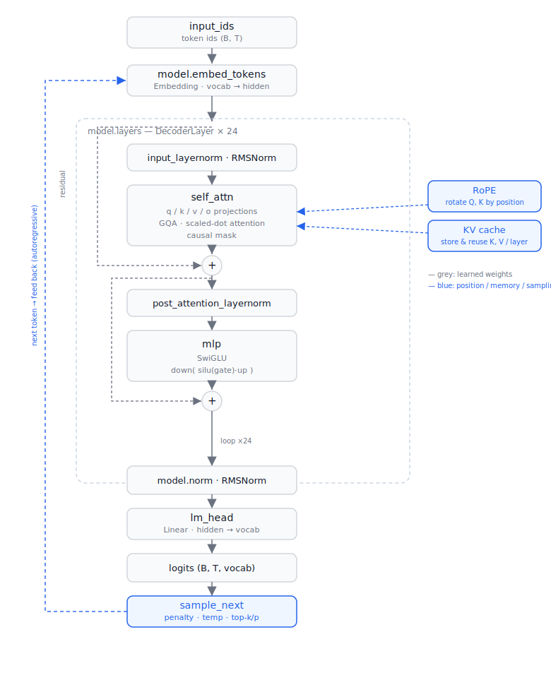

# CausalLM Architecture (Llama / Qwen2 family)

> The architecture as implemented in `hf-model-inference/src/model.py`. This is a
> decoder-only transformer — the structure behind Llama-3.2, Qwen2.5, Mistral,
> and most modern open LLMs. Module names mirror HuggingFace so weights load
> directly.

Concrete numbers below use **Qwen2.5-0.5B-Instruct** (the model in `models/`):
24 layers, hidden size 896, 14 query heads, 2 KV heads, head_dim 64, vocab 151,936.

---

## 1. Top-level flow



```
input_ids (B, T)
      │
      ▼
model.embed_tokens        Embedding: vocab → hidden        (B, T, H)
      │
      ▼
┌─────────────────────────────────────────────┐
│  model.layers — DecoderLayer × 24            │
│                                              │
│   x ── input_layernorm ── self_attn ──(+)──┐ │
│   │                                        │ │
│   └──────────── residual ──────────────────┘ │
│   │                                          │
│   x ── post_attn_layernorm ── mlp ──(+)──┐   │
│   │                                      │   │
│   └────────────── residual ──────────────┘   │
└─────────────────────────────────────────────┘
      │
      ▼
model.norm                final RMSNorm                    (B, T, H)
      │
      ▼
lm_head                   Linear: hidden → vocab           (B, T, vocab)
      │
      ▼
logits  ──►  sample_next  ──►  next token  ──┐
      ▲                                       │
      └─────── autoregressive feedback ───────┘
```

The central column is the **residual stream**. Attention and the MLP never modify
it directly — they read a *normalized copy*, compute, and add their result back
via the `+` nodes. That clean highway is what lets 24 layers stack without the
signal degrading.

---

## 2. The components

### embed_tokens — `nn.Embedding(vocab_size, hidden_size)`

A lookup table. Each token id selects one row — its `hidden_size`-dim vector.
Output shape `(B, T, H)`. (With tied embeddings, this same matrix is reused,
transposed, as the `lm_head`.)

### RMSNorm

Root-mean-square normalization, applied **pre-norm** (before each sublayer):

```
y = x / sqrt(mean(x²) + eps) * weight
```

Computed in fp32 then cast back, matching HF for numerical parity. Cheaper than
LayerNorm (no mean-subtraction, no bias). Each layer has two: `input_layernorm`
(before attention) and `post_attention_layernorm` (before the MLP).

### self_attn — Grouped-Query Attention with RoPE

The core mixing operation. Steps:

1. Project the normalized input to queries, keys, values:
   `q_proj`, `k_proj`, `v_proj`. Queries get **14 heads**, keys/values only
   **2 heads** (GQA — see below). Qwen adds a bias on q/k/v; Llama does not.
2. **RoPE**: rotate Q and K by an angle set by each token's absolute position
   (encodes position; makes attention relative-distance aware).
3. **KV cache**: append this step's K/V to the cached K/V for this layer.
4. **GQA expand** (`repeat_kv`): broadcast the 2 KV heads up to 14 to match the
   query heads.
5. **Scaled dot-product attention** with a causal mask (a token may only attend
   to itself and earlier tokens).
6. `o_proj`: project the concatenated heads back to `hidden_size`.

### mlp — SwiGLU feed-forward

Per-token transformation, no mixing across positions:

```
mlp(x) = down_proj( silu(gate_proj(x)) * up_proj(x) )
```

Two parallel up-projections (`gate`, `up`), a SiLU gate, an element-wise product,
then `down_proj` back to `hidden_size`. The intermediate width (`intermediate_size`,
4864 for Qwen-0.5B) is several × the hidden size — this is where most of the
parameters and compute live.

### lm_head — `nn.Linear(hidden_size, vocab_size, bias=False)`

Projects the final hidden state to one logit per vocabulary token. Only the last
position's logits are needed to predict the next token. Often **tied** to
`embed_tokens` (shares the same weight matrix).

---

## 3. The DecoderLayer (pre-norm residual)

Each of the 24 layers is exactly:

```python
# attention block
h = self_attn(input_layernorm(x), cos, sin, past_kv)
x = x + h                                    # residual 1

# feed-forward block
x = x + mlp(post_attention_layernorm(x))     # residual 2
```

Two sublayers, each wrapped as `x = x + sublayer(norm(x))`. **Pre-norm** (norm
*inside* the residual, before the sublayer) is what makes deep stacks train and
run stably. Attention mixes information *across* tokens; the MLP processes each
token *independently*. Alternating them is the whole transformer idea.

---

## 4. Two ideas that dominate inference

### Grouped-Query Attention (GQA)

Queries use many heads (14), keys/values few (2). The KV heads are shared across
groups of query heads. Why: the **KV cache**, not the weights, dominates memory
at long context. Fewer KV heads → a proportionally smaller cache. Here it's ~7×
smaller than full multi-head attention would be:

```
KV cache per token = 2 (K&V) × 24 layers × 2 kv_heads × 64 dim × 2 bytes ≈ 12 KB
1,000 tokens ≈ ~12 MB
```

### KV cache

Each layer keeps its own `(K, V)` from all previous tokens, shaped
`(B, n_kv_heads, seq_len, head_dim)`. During decode you feed only the **one new
token**, compute its K/V, append to the cache, and attend over the whole history
— instead of recomputing every past token each step. The cache lives on the
device (GPU/MPS) and grows by one position per step.

The bridge to positions: because you feed only the new token, RoPE must be told
its *true* index. That's why the model reads `past_len` from the cache and sets
`positions = arange(past_len, past_len + t)` — the new token's absolute position,
not 0.

---

## 5. Shapes cheat-sheet (Qwen2.5-0.5B, prefill of T tokens)

| Tensor | Shape |
|---|---|
| input_ids | (B, T) |
| after embed_tokens | (B, T, 896) |
| q | (B, 14, T, 64) |
| k, v | (B, 2, T, 64) |
| k, v after repeat_kv | (B, 14, T, 64) |
| attention output | (B, T, 896) |
| mlp intermediate | (B, T, 4864) |
| logits | (B, T, 151936) |
| per-layer KV cache | (B, 2, seq_len, 64) × 2 |

---

## 6. Map to the code

| Concept | Where in `src/` |
|---|---|
| Embedding, layer stack, final norm | `model.py` → `Decoder` |
| One layer (2 residual blocks) | `model.py` → `DecoderLayer` |
| GQA + RoPE + KV cache | `model.py` → `Attention`, `repeat_kv` |
| SwiGLU | `model.py` → `MLP` |
| RMSNorm | `model.py` → `RMSNorm` |
| Position → cos/sin | `rope.py` |
| logits → token | `generate.py` → `sample_next` |
| autoregressive loop | `generate.py` → `generate` |

---

### Notes

- Architecture is selected by `general.architecture` / `config.json["model_type"]`; the *shape* (this doc) is shared across the Llama/Qwen family, only the hyperparameters differ.
- This is the readable form. Production engines keep the same structure but add fused kernels (FlashAttention), a pre-allocated/paged KV cache, quantized weights, and batching. The five-step flow and this layer structure never change.
