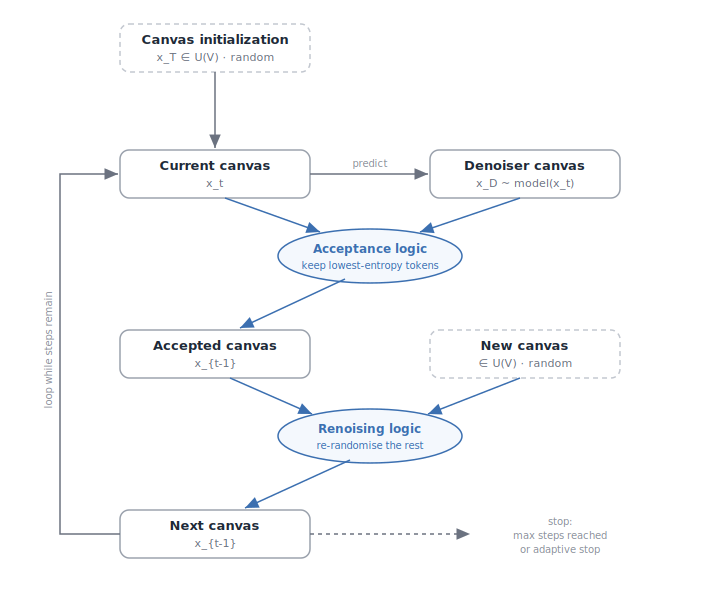

# DiffusionGemma Architecture (as a diff from our Gemma4 spec)

> Built on `gemma4-architecture.md`. **DiffusionGemma keeps the Gemma 4 26B-A4B MoE
> *backbone* — RMSNorm, GeGLU, GQA + RoPE, sparse MoE FFN, vision tower — and replaces
> the *generation method*: instead of autoregressive next-token decoding it does
> **discrete text diffusion**, denoising a fixed-size **canvas** of tokens in parallel
> and committing it in **blocks** (block-autoregressive). The backbone is mostly familiar;
> the genuinely new thing is **how tokens come out**, and that is exactly the part lollm's
> shared `generate` loop cannot drive. This doc states what's *new vs Gemma4* and where it
> would land in a `src/diffusion_gemma/` family — and is explicit about what the model card
> does **not** tell us, because the engine's rule is "hard-fail, never guess."
>
> Target model: **`google/diffusiongemma-26B-A4B-it`** (safetensors, HF, Apache-2.0).
> HF `model_type` tag: **`diffusion_gemma`**; transformers class
> **`DiffusionGemmaForBlockDiffusion`** (loaded via `AutoModelForMultimodalLM` /
> `image-text-to-text` pipeline). Released 2026-06-10 by Google DeepMind. **Experimental** —
> Google itself says output quality is below autoregressive Gemma 4 (it trades quality for
> speed) and recommends Gemma 4 for production.

---

## TL;DR — what actually changes

| Axis | Gemma 4 26B-A4B (AR) | DiffusionGemma 26B-A4B | lollm impact |
|---|---|---|---|
| **How text is produced** | one token per forward pass, left→right | denoise a **256-token canvas** in parallel; ~15–20 tokens finalized per pass | **breaks `generate.py`** — needs a new non-AR loop |
| **Decode attention** | causal (look back only) | **bidirectional** over the canvas | the causal-mask assumption in `attention.py` no longer holds on the canvas |
| **Self-correction** | none — a token is committed once | yes — low-confidence tokens are **re-noised** and redrawn on a later pass | sampler is iterative, not a single `argmax`/`multinomial` |
| **Long outputs** | just keep decoding | **block-autoregressive**: finish a canvas → commit to KV cache → start the next | outer loop over blocks, inner loop over denoising steps |
| **Stopping** | hit an eos id | **adaptive stopping** on canvas entropy + prediction stability | not an eos-set membership test |
| **Backbone math** | Gemma 4 MoE decoder | **same** (per the card: "shares the same backbone") | the `blocks.py` / weight map can largely follow `gemma4`/`qwen3_5_moe` |

So: the **forward pass** is close to a Gemma-4 MoE decoder (high reuse), but the
**generation procedure** is a different algorithm. In lollm terms, ~80% of the novelty is
in a *new* `generate_diffusion` loop + sampler, not in `blocks.py`.

---

## Confirmed facts (from the official model card)

These are the only numbers the card states. Anything not here is in **MUST-VERIFY** below;
we do not fill gaps with Gemma-4 defaults (a config we haven't read is a guess).

| Field | Value | Note |
|---|---|---|
| Total parameters | **25.2B** | card says "26B" colloquially |
| Active parameters | **3.8B** | "A4B" |
| Layers | **30** | (Gemma4 E2B was 35; this is the larger 26B-A4B config) |
| Sliding window | **1024** | (E2B was 512) |
| Context length | up to **256K** | |
| **Canvas length** | **256** | the diffusion block size — new concept |
| Vocab size | **262K** | same family tokenizer as Gemma (SentencePiece) |
| Experts | **8 active / 128 total + 1 shared** | sparse MoE FFN |
| Modalities | text, image (+ video as frames) | output is text only |
| Vision encoder | **~550M** params | Gemma-lineage SigLIP-style ViT |
| License | Apache-2.0 | (note: more permissive than Gemma-4's own terms) |

**Generation / sampler (card "Best Practices"):**

- **Method:** Diffusion sampling with **Entropy-Bounded Denoising** + **Adaptive Stopping**.
- **Max denoising steps:** 48 per canvas.
- **Temperature schedule:** linear decay **0.8 → 0.4** across steps (logit shaping).
- **Token selection per step:** keep the **lowest-entropy** tokens such that their mutual-
  information bound stays **below `entropy_bound = 0.1`**; **fully re-noise the rest**.
- **Adaptive stop** (both must hold): average canvas entropy **< 0.005**, *and* the argmax
  token predictions are **identical across two consecutive steps** (stable).
- **Thinking mode:** `<|think|>` at the **start of the system prompt** turns it on; the
  reasoning is emitted in a channel `<|channel>thought\n … <channel|>`. With thinking off,
  the tags still appear but the thought block is empty. In multi-turn history, **drop prior
  thoughts** before the next user turn.
- **Multimodal:** image **before** text; visual token budget ∈ {70, 140, 280, 560, 1120};
  video ≤ 60 s at 1 fps.

---

## The core mechanism — discrete text diffusion



*The `EntropyBoundSampler` loop (rung 3). The canvas starts as **random** tokens; each step the
denoiser predicts a canvas, acceptance keeps the lowest-entropy tokens, the rest are re-randomised,
and the loop repeats. Acceptance is recomputed every step, so a token committed early can be
re-randomised later — the self-correction property.*

### Autoregressive vs diffusion, in one breath

An AR model (Gemma 4, every current lollm family) factorizes `p(x) = Π p(x_t | x_<t)` and
samples one token at a time. Each step reloads the weights to produce a *single* token — so
single-user decode is **memory-bandwidth bound** and the tensor cores sit mostly idle.

DiffusionGemma instead starts from a **canvas** of 256 **random** tokens (uniform over the
vocabulary — "Uniform State Diffusion") and **iteratively denoises all of them at once**. Each forward pass looks at the whole (partly
resolved) canvas with **bidirectional** attention, predicts a distribution for every
position, **commits the most-confident** positions, and **re-noises the rest** to try again
next pass. After ≤48 passes (usually far fewer) the canvas "snaps into focus." Because every
pass resolves ~15–20 positions instead of 1, the work becomes **compute-bound** and uses the
otherwise-idle cores — the source of the 4× throughput (1100+ tok/s on H100 FP8).

> The launch blog / press call the noising scheme **"Uniform State Diffusion"** and frame
> confident tokens as helping resolve their neighbors. The model card itself does not use
> that term, so treat it as background, not a spec to implement against.

### Why it can self-correct (and AR can't)

Bidirectional attention means a token drawn on pass 3 can be **reconsidered** on pass 4 in
light of tokens that appeared elsewhere — and if its confidence drops, the sampler re-noises
it and redraws. An AR model physically cannot: position `t` is conditioned only on `x_<t`
and is frozen the instant it's emitted. This is what makes diffusion good at **infilling /
non-linear edits** and **constrained generation** (the card's Sudoku example), and weaker on
strict left-to-right reasoning chains (note the benchmark gaps: AIME 69 vs 88, BBEH 48 vs 65).

### Encoder / decoder split — and the one big ambiguity

The card describes an **encoder–decoder** shape:

- **Encoder = prefill.** An **autoregressive (causal)** pass ingests the prompt and writes
  the **KV cache** — exactly like a normal Gemma-4 prefill.
- **Decoder = denoiser.** Applies **bidirectional** attention over the current canvas and
  (card wording) "accesses the cached context via **cross-attention**."
- **Block-autoregressive outer loop.** Once a canvas is fully denoised it is "processed by
  the encoder and **appended to the KV cache**," then the next canvas starts conditioned on
  all committed history.

**Unresolved (MUST-VERIFY, see below):** whether this is a *single shared 30-layer backbone
run in two attention modes* (causal for prefill/commit, bidirectional within the canvas) —
which the press descriptions and "shares the same backbone … developers mainly need to
implement a denoising step" strongly imply — **or** a literal two-tower encoder–decoder with
separate cross-attention weights. These map to very different `weights.py`/`kv.py` designs.
The card's "cross-attention" phrasing and the press's "two attention modes on one backbone"
**disagree**, and we do not pick one without reading `config.json` + the modeling source.

---

## The generation loop — pseudocode (the heart of the family)

This is the part with **no analog** in any current lollm family. Shape: an **outer**
block-autoregressive loop, an **inner** denoising loop.

```text
# committed = the prompt's KV cache (causal prefill, like today)
committed_kv = encoder_prefill(prompt_ids)              # causal, writes KV cache

while not done:                                         # OUTER: one 256-token block per iter
    canvas = mask_tokens(canvas_len=256)                # all positions start "noised"
    temp_schedule = linear(0.8 -> 0.4, steps<=48)

    for step in range(max_denoise_steps=48):            # INNER: refine the whole canvas
        logits = decoder(canvas, committed_kv)          # BIDIRECTIONAL over canvas
        probs  = softmax(logits / temp_schedule[step])
        ent    = entropy(probs)                         # per position

        keep = positions whose entropy is low enough that the
               mutual-information bound stays < entropy_bound(0.1)
        canvas[keep]      = argmax/sample(probs[keep])  # commit confident positions
        canvas[~keep]     = re-noise()                  # redraw the rest next pass

        if mean(ent) < 0.005 and argmax(probs) unchanged_for_2_steps:
            break                                       # ADAPTIVE STOP — early exit

    emit(canvas)                                        # stream the resolved block
    committed_kv = append(committed_kv, encode(canvas)) # commit block to KV cache
    done = produced_eos_or_hit_max_tokens
```

Contrast with today's `generate.py`: that is the inner-only, one-token special case
(`canvas_len = 1`, `denoise_steps = 1`, causal attention, commit-and-never-revisit). The
diffusion loop is a strict superset, which is why it must live in a **new** function rather
than bend the shared one.

---

## What this breaks in lollm (the honest part)

1. **`generate.py` cannot drive it.** The shared loop is `forward → sample_next → append →
   stop-on-eos`, one token per iter. Diffusion needs the outer/inner structure above. Per
   CONVENTIONS §4 ("the loop is shared; if a family needs a different loop we change *this*"),
   this is the rare case that forces a **second** loop — `generate_diffusion` — selected by
   the family, not a tweak to the AR loop. Keep the AR loop pristine.

2. **The causal-mask assumption in `attention.py` is violated on the canvas.** `torch_attention`
   is "offset-causal" by construction; the decoder pass over the canvas is **bidirectional**
   (full attention among the 256 canvas positions, plus attention into the committed cache).
   That's a new mask shape, not `is_causal=True`. Prefill/commit stay causal.

3. **KV-cache semantics change.** Today the cache grows one token per step. Here it grows
   **one block per outer iteration**, and the canvas positions are *transient* (re-noised in
   place) until the block commits. `kv.py` needs block-commit semantics, not per-token append.

4. **Sampling is iterative, not a draw.** `sample_next` (temp/top-k/top-p/rep-penalty →
   one token) is replaced by an **entropy-bounded denoiser** with a temperature *schedule*,
   per-position confidence selection, re-noising, and a two-condition adaptive stop. Different
   primitive entirely.

5. **Stopping is not eos-membership.** Termination is canvas-entropy + prediction-stability
   (inner), and eos/length (outer). The `stop_ids` set still matters for the outer loop only.

6. **It's multimodal-first.** Like gemma4, the vision tower + soft-token merge are real work;
   text-only is the sane first milestone (and the only one we could parity-check without
   images).

---

## Map to our design — a hypothetical `src/diffusion_gemma/`

Copy `gemma4/` (and borrow MoE bits from `qwen3_5_moe/`), then replace the loop.

- **config.py** — `DiffusionGemmaConfig.from_hf` reads the nested `text_config`. Surface the
  confirmed fields (30 layers, sliding_window 1024, vocab 262144, MoE 8/128 + 1 shared,
  canvas_len 256) **plus** the diffusion knobs (`max_denoise_steps`, `entropy_bound`,
  temp schedule, adaptive-stop thresholds) — read from the checkpoint, **never** defaulted.
  GGUF: **hard-fail** (novel `diffusion_gemma` keys unverified vs llama.cpp; llama.cpp support
  is "coming soon" per the press, so raise until confirmed).
- **blocks.py** — reuse Gemma-4 RMSNorm / GeGLU / GQA+RoPE / QK-norm and the
  `qwen3_5_moe` sparse-MoE FFN (8/128 + shared). Add a **bidirectional** attention variant
  for the canvas (no causal mask among canvas positions).
- **modeling_diffusion_gemma.py** — the 30-layer MoE stack with **two attention modes**
  (causal prefill/commit vs bidirectional canvas). Exposes the encoder-prefill and a
  `denoise(canvas, committed_kv) -> logits` entry — **not** the `forward(ids, past)` contract
  the AR loop expects.
- **sampler / generate_diffusion** — new shared-ish infra: the entropy-bounded denoiser +
  temperature schedule + adaptive stop + block commit. This is the file a learner actually
  comes here to read.
- **kv.py** — block-commit cache (grow per block; transient canvas).
- **weights.py** — Gemma-4 map + MoE expert stacking; **strip whatever nesting the checkpoint
  uses** (the HF snippet loads it as a multimodal/conditional-generation model, so expect a
  `language_model.` / `model.` nesting like gemma4 — MUST-VERIFY the exact prefix). Tie
  `lm_head ← embed_tokens` unless the checkpoint says otherwise.
- **__init__.py** — `MODEL_TYPES = {"diffusion_gemma"}`, sampling DEFAULTS reflecting the
  card's recommended diffusion settings, `register(load)`.
- **run.py** — needs a branch (like `--mtp`) to pick `generate_diffusion`; the AR path is
  untouched.

---

## MUST-VERIFY before any implementation (the card omits these)

The model card gives generation recipe + headline dims but **not** the full architecture
config. Per "hard-fail, never guess," none of these may be assumed from Gemma 4:

- **Per-layer dims:** `hidden_size`, `num_attention_heads`, `num_key_value_heads`,
  `head_dim` (and any asymmetric local/global head dims), MLP intermediate widths
  (dense + `moe_intermediate_size`), shared-expert width. *None are in the card.*
- **Attention pattern:** the local/global `layer_types` schedule and the two RoPE thetas
  (Gemma 4 used 5:1 local/global, dual RoPE — unconfirmed here at 30 layers, window 1024).
- **Encoder vs decoder reality:** single shared backbone in two attention modes **or** a true
  cross-attention two-tower? (Card says "cross-attention"; press says "one backbone, two
  modes." Resolve against `config.json` + modeling source — this drives `weights.py`/`kv.py`.)
- **Exact diffusion config keys:** how `canvas_len`, `max_denoise_steps`, `entropy_bound`,
  the temp schedule, and the adaptive-stop thresholds are named/stored in `config.json`.
- **Tokenizer specials:** the `<|think|>` / `<|channel>thought` control tokens and the chat
  template (the card notes transformers handles the template — confirm a `chat_template.jinja`
  ships, per LESSONS L-4).
- **Weight-name nesting** for the multimodal checkpoint, and which tensors the vision tower
  vs the text decoder own.
- **MoE routing details:** `num_experts_per_tok` (router top-k), `norm_topk_prob`,
  `decoder_sparse_step` / `mlp_only_layers`. (And recall: in `qwen3_5_moe` a missing
  `num_experts_per_tok` now **hard-fails** rather than defaulting to 0 — do the same here.)

The right tool for all of these is the project's **strict loader**: build the model from the
read config and let `load_state_dict(strict=True)` name every missing/extra tensor precisely.

---

## Parity & caveats (study notes)

- **No `transformers` parity gate yet.** `compare_logits` compares **argmax next-token** vs a
  `transformers` AR reference. Diffusion has no single "next token," so the gate needs a new
  notion of parity — e.g. compare the **denoiser logits** on a fixed canvas/step against
  `DiffusionGemmaForBlockDiffusion`, or compare the **committed block** under a fixed seed.
  Until that exists, treat any text output as unproven (CONVENTIONS: "fluent ≠ correct").
- **Determinism.** The sampler re-noises and uses a temperature schedule; pin every RNG and
  the step schedule before comparing runs, or "parity" is noise.
- **Quality expectation.** The card is candid: lower benchmarks than AR Gemma 4. A faithful
  reimplementation should *reproduce that gap*, not beat it — a suspiciously good result is a
  bug (e.g. accidentally leaking left-to-right structure).
- **Throughput is a GPU story.** The 4× win is compute-bound parallelism on a real
  accelerator; on CPU/MPS the parallel canvas won't show the same speedup (fine for a parity
  gate, not for a perf claim).
- **Scope.** Text-only denoising first; vision tower second; GGUF only after the
  `diffusion_gemma` metadata is verified against llama.cpp (hard-fail until then).

---

### Sources

- [google/diffusiongemma-26B-A4B-it — model card / README (Hugging Face)](https://huggingface.co/google/diffusiongemma-26B-A4B-it)
- [Launch blog — Google (Diffusion Gemma: faster text generation)](https://blog.google/innovation-and-ai/technology/developers-tools/diffusion-gemma-faster-text-generation/)
- [DiffusionGemma documentation — Google AI for Developers](https://ai.google.dev/gemma/docs/diffusiongemma)
- [Google AI Releases DiffusionGemma … 4x Faster Generation — MarkTechPost](https://www.marktechpost.com/2026/06/10/google-ai-releases-diffusiongemma-a-26b-moe-open-model-using-text-diffusion-for-up-to-4x-faster-generation/)

> **Provenance note:** confirmed dims + the sampler recipe are from the official model card.
> The "Uniform State Diffusion" name and the "one backbone, two attention modes" reading are
> from the launch blog / press coverage and are flagged as **MUST-VERIFY**, not spec.
