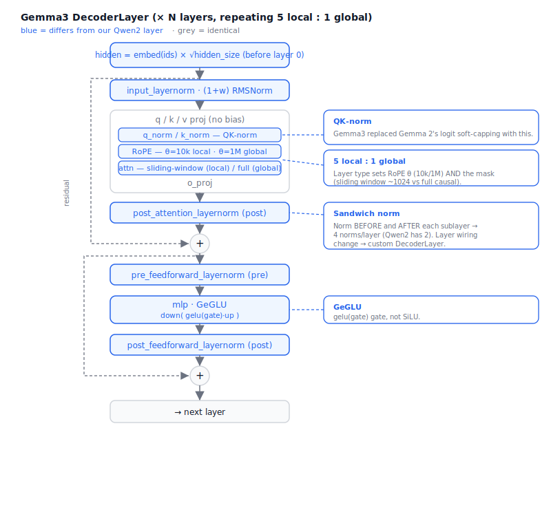

# Gemma3 Architecture (as a diff from our Qwen2 model)

> Built on the decoder-only model in `causalLM-architecture.md`. Gemma3 keeps the
> skeleton (token embed → N decoder layers → final norm → LM head, GQA, RoPE,
> residual stream) but changes enough that it's a **level 2–3 plugin**, not a
> recombination. This doc states exactly what differs and where it lands in our
> code — the spec for a real `archs/create_gemma3.py`.



---

## Summary — what changes vs Qwen2

| Component | Qwen2 (what we built) | Gemma3 | Override level |
|---|---|---|---|
| Norm | RMSNorm (`w · x̂`) | RMSNorm **`(1 + w) · x̂`** | 1 (block) |
| Norm placement | pre-norm (2/layer) | **sandwich**: pre **and** post (4/layer) | 2 (layer) |
| Attention | GQA + RoPE | GQA + RoPE + **QK-norm** | 1 (block) |
| Attn scale | `1/√head_dim` | **`query_pre_attn_scalar^-0.5`** | 1 (block) |
| Soft-capping | none | none (Gemma**2** had it; **Gemma3 dropped it for QK-norm**) | — |
| MLP | SwiGLU (`silu`) | **GeGLU** (`gelu_pytorch_tanh`) | 1 (block) |
| Attention span | full causal, every layer | **5 local : 1 global** (sliding window vs full) | 3 (mask + per-layer) |
| RoPE θ | single (1e6) | **dual**: 10k local, 1e6 global (+ scale 8 global) | 3 (per-layer RoPE) |
| Embeddings | as-is | **× √hidden_size** before layer 0 | 2 (forward) |
| Output head | separate or tied | **tied** to embeddings | 0 (we handle) |

So Gemma3 touches the **block** (norm, attention, MLP), the **layer wiring**
(sandwich norm), the **forward** (embedding scale), and the **attention mask + RoPE**
(local/global). That spread is exactly why it's a deep drop-in.

---

## The changes in detail

### 1. `(1 + weight)` RMSNorm  *(level 1 — block)*

Gemma normalizes, then scales by `(1 + weight)` (weight zero-initialized), in fp32:

```python
return (x_normed * (1.0 + self.weight.float())).to(dtype)
```

Ours scales by `weight` directly. → `GemmaRMSNorm`, injected via `Blocks(norm=...)`.
(Already in the `create_gemma3.py` template.)

### 2. Sandwich norm  *(level 2 — layer wiring)*

Gemma norms **before and after** each sublayer, so a layer has **four** norms:

```
x = x + post_attention_layernorm( attn( input_layernorm(x) ) )
x = x + post_feedforward_layernorm( mlp( pre_feedforward_layernorm(x) ) )
```

Our `DecoderLayer` has only `input_layernorm` + `post_attention_layernorm` used as
*pre*-norms. Gemma adds `pre_feedforward_layernorm` and `post_feedforward_layernorm`
and uses the post ones as true *post*-norms (inside the residual). → a custom
`GemmaDecoderLayer`.

### 3. QK-norm  *(level 1 — block; the headline Gemma3 change)*

After q/k projection and reshaping to heads, Gemma3 applies RMSNorm over `head_dim`
to **Q and K** before RoPE:

```
q = q_norm(q); k = k_norm(k)      # RMSNorm(head_dim)
q, k = apply_rope(q, k, ...)
```

This **replaced Gemma 2's logit soft-capping** — same goal (tame attention logits),
better accuracy and speed. → `GemmaAttention` with `q_norm`/`k_norm`. Note the
attention scale is `query_pre_attn_scalar^-0.5`, not `1/√head_dim`, so pass an
explicit `scale=` to `scaled_dot_product_attention`.

### 4. GeGLU MLP  *(level 1 — block)*

Same shape as SwiGLU, different activation — approximate GELU on the gate:

```
down( gelu_tanh(gate(x)) * up(x) )      # vs our silu(gate(x)) * up(x)
```

→ `GemmaMLP` (or a one-line activation swap), injected via `Blocks(dense_ffn=...)`.

### 5. Embedding scaling  *(level 2 — forward)*

Token embeddings are multiplied by `√hidden_size` before the first layer:

```
x = embed_tokens(ids) * (hidden_size ** 0.5)
```

→ override `CausalLM.forward` (one line at the top).

### 6. Hybrid local/global attention + dual RoPE  *(level 3 — the hard part)*

This is the real work and the reason `build_model` is guarded:

- **5 local : 1 global** — five layers use **sliding-window** attention (window
  ~1024), then one layer uses **full** global attention, repeating. Each layer must
  know its type (by index).
- **Dual RoPE** — local layers use `θ = 10,000`; global layers use `θ = 1,000,000`
  with an additional RoPE **scale factor of 8** (for long context). Build **two**
  RoPE tables once and pick per layer.
- **Masking** — our attention uses `scaled_dot_product_attention(is_causal=True)`,
  which is *full* causal only. Local layers need an explicit **band mask** (each
  query attends only to the last `window` keys). Global layers keep `is_causal`.

In our terms: a `GemmaDecoderLayer(is_global)` carrying its type, a `GemmaAttention`
taking `(window, rope_table, scale)`, two `RotaryEmbedding`s built in the model, and
a forward that threads the right RoPE + mask per layer. The KV cache stays our
list-of-(k, v); only the *mask* differs for local layers (a production engine would
also shrink the cache on local layers — an optimization, not needed for correctness).

---

## Tensor names (HF) — for loading

Same `model.layers.N.*` skeleton as Qwen2, plus the new norms and QK-norm:

```
model.layers.N.input_layernorm.weight
model.layers.N.self_attn.{q,k,v,o}_proj.weight       # no bias (unlike Qwen2)
model.layers.N.self_attn.q_norm.weight               # NEW (QK-norm)
model.layers.N.self_attn.k_norm.weight               # NEW
model.layers.N.post_attention_layernorm.weight
model.layers.N.pre_feedforward_layernorm.weight      # NEW (sandwich)
model.layers.N.post_feedforward_layernorm.weight     # NEW (sandwich)
model.layers.N.mlp.{gate,up,down}_proj.weight
model.embed_tokens.weight   model.norm.weight         # lm_head tied to embed_tokens
```

The two new norms + `q_norm`/`k_norm` are exactly the tensors a Qwen2-style name map
would be *missing* — which the strict safeguard would catch at load (good).

---

## Map to our design

A real `archs/create_gemma3.py` is a **level 2–3 plugin**:

- **blocks** (`layers`-style, defined in the plugin file): `GemmaRMSNorm`,
  `GemmaMLP`, `GemmaAttention` (QK-norm + custom scale).
- **layer**: `GemmaDecoderLayer` (sandwich norm + carries local/global type).
- **model**: a thin `CausalLM` subclass overriding `forward` (embedding scale) and
  building two RoPE tables; `build_model` wires it.
- **config**: read `query_pre_attn_scalar`, `sliding_window`, `sliding_window_pattern`,
  `rope_local_base_freq`, `rope_theta` into `cfg.extra`.
- **name map**: extend the dense map with `q_norm`, `k_norm`,
  `pre/post_feedforward_layernorm`.
- **validate**: `compare_logits` vs transformers — non-negotiable for an arch this
  different.

This is the case the "override at any level" design exists for: Gemma3 reaches into
blocks, layer wiring, forward, RoPE, and masking — yet it's still one plugin file,
and the engine, backends, and generation loop don't change.

---

### Sources

- [Gemma 3 Technical Report (arXiv:2503.19786)](https://arxiv.org/abs/2503.19786)
- [Gemma explained: what's new in Gemma 3 — Google Developers Blog](https://developers.googleblog.com/gemma-explained-whats-new-in-gemma-3/)
- [Gemma 3 deep dive — Naman Goyal](https://namangoyal.com/blog/2025/gemma3/)
