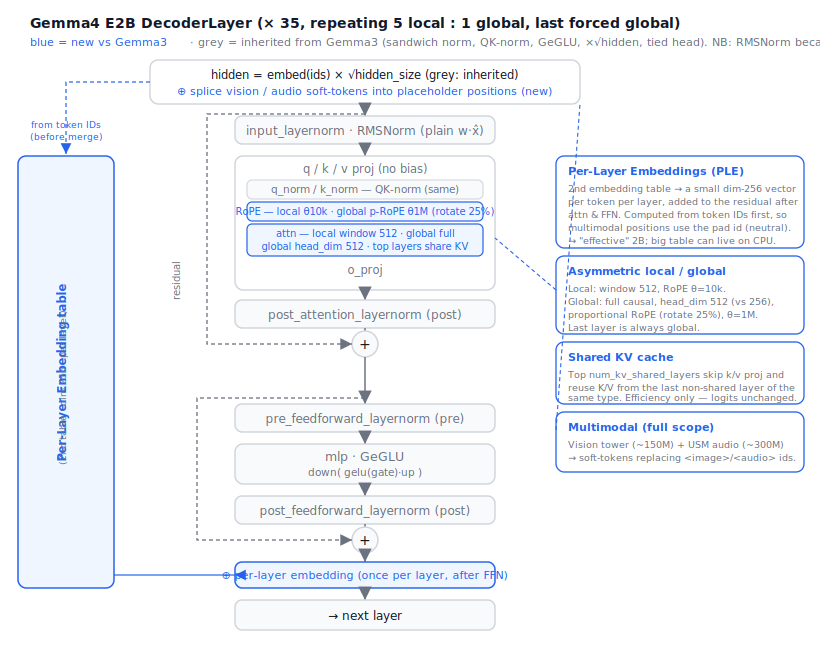

# Gemma4 Architecture (as a diff from our Gemma3 spec)

> Built on `gemma3-architecture.md` (itself a diff from Qwen2). Gemma4 keeps the
> whole Gemma3 decoder — `(1+w)` RMSNorm, **sandwich norm**, **QK-norm**, **GeGLU**,
> embedding **×√hidden**, **tied** head, **5 local : 1 global** attention with
> **dual RoPE** — and adds three text-side mechanisms (**Per-Layer Embeddings**,
> **shared KV cache**, **asymmetric local/global heads**) plus two **encoders**
> (vision, audio). This doc states only what's *new vs Gemma3* and where it lands
> in a `src/gemma4/` family package (the `qwen2/` five-file shape).
>
> Target model: **`google/gemma-4-e2b-it`** (safetensors, HF). "E2B" = *effective*
> 2B — the small footprint comes from **PLE**, not MatFormer. Gemma4 deliberately
> **drops** the most exotic Gemma-3n pieces (**AltUp**, **LAuReL**), so E2B is
> "Gemma3 + PLE + shared-KV + bigger global heads," not a from-scratch arch.



---

## As-built corrections (E2B, verified vs `transformers` `modeling_gemma4.py`)

The early spec below was written from the blog + config-class defaults. Implementing
`src/gemma4/` against the **real `google/gemma-4-e2b-it` config + the modeling source**
surfaced several differences from Gemma3 that the prose further down hadn't captured —
these are authoritative:

- **RMSNorm changed.** Gemma4 uses **plain `w·x̂` with ONES init**, *not* Gemma2/3's
  `(1+w)`. There's also a no-weight variant (`with_scale=False`) used for a new **v_norm**.
- **Attention scale = 1.0.** `query_pre_attn_scalar` is gone; the QK-norm absorbs scaling.
  (We pass `scale=1.0` to the shared attention core.)
- **V-norm.** V is RMSNorm-normalized (no weight) before attention, alongside QK-norm.
- **PLE injects ONCE per layer**, after the FFN residual (gate→gelu→×per-layer→proj→
  norm→add) — not once after attention and once after FFN. (The SVG shows two for
  emphasis; the code/reference does one.)
- **Final logit soft-cap is back: 30.0** (Gemma3 had none). No *attention* soft-cap.
- **Double-wide MLP** (`use_double_wide_mlp`) applies **only to the shared-KV layers**
  (2× intermediate); non-shared layers use the normal width.
- **E2B real dims:** 35 layers, hidden 1536, intermediate 6144, 8 heads, **1 KV head**
  (MQA), head_dim **256 local / 512 global**, `num_kv_shared_layers=20`,
  `layer_types` period 5 (full at indices 4,9,…,34; last = full), vocab 262144,
  PLE dim 256.
- **Shared-KV donors:** the last non-shared layer of each type (sliding=13, full=14)
  store full K/V; layers 15–34 reuse it (no k/v projections on those layers).
- **Per-layer residual scale.** Each layer ends with `hidden_states *= layer_scalar`,
  a **saved buffer** (LayerScale-style, *not* always 1.0). It's a buffer, not a
  parameter — see the parity story below.

### Parity status — ✅ PASSED

Validated against `transformers` on `google/gemma-4-e2b-it` (fp32 CPU): final-token
**cosine ≈ 1.0, same top token**, and `gemma4_debug.py` shows per-layer hidden-state
cosine ≈ 1.0 across all 35 layers.

```bash
huggingface-cli login
python src/compare_logits.py --model google/gemma-4-e2b-it   # PASS ✅
python src/gemma4_debug.py                                   # per-layer cos ≈ 1.0
python src/gemma4_selftest.py                                # offline structural checks
```

**The bug that took the most finding** (recorded so the next arch doesn't repeat it):
the per-layer `layer_scalar` is a **buffer**, and the streaming loader only loaded
`named_parameters()`, so it was silently left at the default 1.0 while the checkpoint's
value ≠ 1. That left every layer's output at the wrong *magnitude* — invisible to a
per-submodule cosine check (cosine is scale-invariant) but it corrupted the
residual-stream proportions of every later layer, so parity was perfect at layer 0 and
collapsed from layer 1 on. Fix: `weights.load` now materializes buffers too. (General
lesson in `LESSONS.md` L-3.)

---

## Summary — what changes vs Gemma3

| Component | Gemma3 (our spec) | Gemma4 E2B | Override level |
|---|---|---|---|
| Norm | RMSNorm `(1+w)·x̂` | same | — |
| Norm placement | sandwich (4/layer) | same | — |
| Attention | GQA + RoPE + **QK-norm** | same | — |
| MLP | GeGLU (`gelu_pytorch_tanh`) | same | — |
| Embed scale | × √hidden | same | — |
| Head | tied to embeddings | same | — |
| Attn span | 5 local : 1 global | same pattern, **last layer forced global**, **window 512** | 1 (config) |
| RoPE | dual (10k local / 1e6 global) | dual, but **global uses *proportional* RoPE** (`partial_rotary_factor 0.25`) | 1 (block) |
| Head dim | uniform (256) | **local 256, global `global_head_dim=512`** (+ optional fewer global KV heads) | 2 (block + layer) |
| K/V proj | separate K and V | optional **`attention_k_eq_v`** (V reuses K projection) | 1 (block) |
| **Per-Layer Embeddings** | none | **NEW** — 2nd embedding table, per-layer residual signal | 2 (forward + new block) |
| **Shared KV cache** | none | **NEW** — top `num_kv_shared_layers` reuse earlier K/V | 2 (model + kv) |
| **Vision encoder** | (Gemma3 had SigLIP; we never built it) | **NEW** — variable aspect ratio + token budgets | 3 (new tower) |
| **Audio encoder** | none | **NEW** — USM-style conformer | 3 (new tower) |

So Gemma4's text decoder is a *small* delta over our Gemma3 plan; the real new
work is **PLE**, the **asymmetric global head**, and (for full multimodal) the two
**encoders**.

---

## E2B config (the real checkpoint, not the HF class defaults)

> The `Gemma4TextConfig` *class defaults* in `transformers` are generic
> (`hidden_size=2304`, `num_hidden_layers=30`) and do **not** match E2B. Always
> read the checkpoint's own `config.json` (it's nested under `text_config`).

| Field | E2B value | Note |
|---|---|---|
| `num_hidden_layers` | **35** | from the model card |
| `hidden_size` | (read from config) | main residual width |
| `num_attention_heads` | 8 | |
| `num_key_value_heads` | 4 | GQA |
| `head_dim` | 256 | **local** layers |
| `global_head_dim` | **512** | **global** layers (larger) |
| `num_global_key_value_heads` | optional | global KV heads; `None` → `num_key_value_heads` |
| `hidden_activation` | `gelu_pytorch_tanh` | GeGLU |
| `sliding_window` | **512** | E2B/E4B (1024 on bigger models) |
| `layer_types` | 5:1 pattern, **last = `full_attention`** | auto-generated if absent |
| `rms_norm_eps` | 1e-6 | |
| `vocab_size` | 262144 | |
| `max_position_embeddings` | 131072 | 128K context |
| `rope_parameters.sliding_attention` | `{rope_type: default, theta: 10000}` | local |
| `rope_parameters.full_attention` | `{rope_type: proportional, partial_rotary_factor: 0.25, theta: 1e6}` | global, **p-RoPE** |
| `attention_k_eq_v` | bool | V reuses K projection when true |
| `num_kv_shared_layers` | int | top-N layers reuse K/V |
| `vocab_size_per_layer_input` | 262144 | PLE table rows |
| `hidden_size_per_layer_input` | **256** | PLE per-layer width |
| `tie_word_embeddings` | true | |
| special tokens | `boi/eoi/image`, `boa/eoa/audio`, `video` IDs | from top-level `Gemma4Config` |

---

## The new pieces in detail

### 1. Per-Layer Embeddings (PLE) — *the headline E2B feature*  *(forward + new block)*

A **second embedding table**, separate from `embed_tokens`, that injects a small
token-specific signal **into every decoder layer** instead of front-loading
everything into the single input embedding.

How it works per token:

```
# one packed table of shape [vocab_size_per_layer_input, num_layers * hidden_size_per_layer_input]
ple_raw   = embed_tokens_per_layer(input_ids)          # (B, T, num_layers * 256)
ple_raw   = ple_raw.view(B, T, num_layers, 256)        # slice per layer
# combine token-identity lookup with a context-aware projection of the MAIN embedding:
per_layer = combine(ple_raw, project(main_embed))      # (B, T, num_layers, 256)
```

Each decoder layer `i` then **modulates** its hidden state with `per_layer[..., i, :]`
via a lightweight residual block **after** attention and FFN (a small projection up
to `hidden_size`, scaled, added to the residual stream). Because the PLE width (256)
≪ `hidden_size`, this is per-layer specialization at modest cost — and it's why the
*effective* parameter count is far below the 5.1B on-disk total (the big table is a
lookup, cacheable to CPU/slow storage).

**Critical inference order (multimodal):** PLE is computed from **token IDs first**,
*before* image/audio soft-tokens overwrite their placeholder positions — once a
placeholder is replaced by a vision/audio vector its ID is gone. Multimodal
positions use the **pad-token ID**, so they receive a neutral per-layer signal.

→ new `PerLayerEmbedding` block + a `CausalLM.forward` change (compute PLE up front,
hand each layer its slice). This is the one component with no analog in any current
family.

### 2. Shared KV cache  *(model wiring + kv.py)*

The **last `num_kv_shared_layers`** decoder layers do **not** compute their own
K/V projections. They **reuse** the K and V tensors from the *last non-shared layer
of the same attention type* (sliding reuses the last sliding layer's K/V; full
reuses the last full layer's). Cuts KV compute and cache size for long context.

**Correctness vs optimization:** computing K/V normally on every layer produces
**identical logits** — sharing only saves memory/compute. So implement the decoder
*without* sharing first, pass the parity gate, then add the indirection in `kv.py`
as a second step. (If a shared layer has no `k_proj`/`v_proj` weights in the
checkpoint, the strict loader will tell you exactly which layers share.)

### 3. Asymmetric local/global heads + proportional RoPE  *(block + layer)*

Unlike Gemma3's uniform heads, Gemma4 makes **global (full-attention) layers wider**:

- **`global_head_dim = 512`** vs local `head_dim = 256`. The attention scale must use
  the *per-layer* head dim (pass an explicit `scale=` to `scaled_dot_product_attention`).
- Optionally **fewer global KV heads** (`num_global_key_value_heads`).
- Global layers use **proportional RoPE** (`rope_type="proportional"`,
  `partial_rotary_factor=0.25`) at θ=1e6 — only the first 25% of head dims are
  rotated. Local layers use plain RoPE at θ=10000.
- **`attention_k_eq_v`**: when true, the value projection *is* the key projection
  (one tensor used for both K and V).

→ `GemmaAttention` takes `(head_dim, kv_heads, rope_table, scale, window)` per layer
type; build **two** RoPE tables (local plain, global proportional) once in the model
and pick per layer. Note this means Q/K/V projection shapes **differ between local
and global layers** — the weight map must not assume one shape for all layers.

### 4. Layer-type pattern

`layer_types` is a per-layer list of `"sliding_attention"` / `"full_attention"`,
auto-generated as **5:1** (every 6th layer global) and the **last layer is always
forced to `full_attention`**. Local layers need an explicit **band mask** (attend to
the last `window=512` keys); global layers stay `is_causal`.

---

## Multimodal (full scope)

Gemma4 is a `Gemma4ForConditionalGeneration`: a text decoder plus a **vision tower**
and (on E2B) an **audio tower**, whose outputs are projected to `hidden_size`
**soft-tokens** that replace placeholder IDs in the input sequence.

> The *input* side — how raw images/audio become the tensors these towers consume
> (decode → normalize → patchify / log-mel), what's standardized, and how a processor
> seam would fit lollm — is written up separately in
> **[multimodal-processors.md](./multimodal-processors.md)**.

### Vision encoder (~150M on E2B)  *(new tower)*

A Gemma-3-lineage SigLIP-style ViT (`Gemma4VisionConfig`: hidden 768, 16 layers,
12 heads, head_dim 64, patch 16, `gelu_pytorch_tanh`, its own QK-norm + RoPE θ=100),
with two upgrades over Gemma 3:

- **Variable aspect ratio** via **learned 2D position embeddings** + multi-dim RoPE
  (table sized by `position_embedding_size`, default 10240).
- **Configurable token budget** per image: **70 / 140 / 280 / 560 / 1120** tokens
  (speed/detail trade-off; spatial pooling `pooling_kernel_size=3`).

Soft-tokens replace `image_token_id` positions, wrapped by `boi`/`eoi`.
Convention: **image content before text** in the prompt.

### Audio encoder (~300M on E2B)  *(new tower)*

A **USM-style conformer** (`Gemma4AudioConfig`: hidden 1024, 12 layers, 8 heads,
sub-sampling conv channels `[128, 32]`, conv kernel 5, **chunked local attention**
with `attention_chunk_size=12`, left-context 13, right-context 0, `attention_logit_cap=50`,
`output_proj_dims=1536`). Emits ~**1 token per 160 ms** (~6 tokens/sec); 30 s max
clip at launch. Soft-tokens replace `audio_token_id` positions, wrapped by `boa`/`eoa`.
Convention: **audio content after text** in the prompt.

### How modalities fold in (forward)

```
# 1. EMBED text:    h = embed_tokens(ids) * sqrt(hidden)
# 2. PLE (from IDs, BEFORE merge):  per_layer = ple(ids, h)   # placeholders use pad id
# 3. ENCODE + MERGE: h[image_pos] = proj_v(vision_tower(pixels));  h[audio_pos] = proj_a(audio_tower(mel))
# 4. DECODER STACK:  35 layers; each layer adds its PLE slice after attn+FFN; local band mask vs global causal
# 5. FINAL NORM
# 6. LM HEAD (tied)
```

---

## Tensor names (HF safetensors) — for loading

It's a **gated** repo (`huggingface-cli login`) and a *conditional-generation*
checkpoint, so the text decoder is **nested** under `model.language_model.*`
(not top-level `model.*`):

```
# text decoder
model.language_model.embed_tokens.weight
model.language_model.embed_tokens_per_layer.weight          # NEW — packed PLE table
model.language_model.layers.N.input_layernorm.weight
model.language_model.layers.N.self_attn.{q,k,v,o}_proj.weight   # no bias; shapes differ local vs global
model.language_model.layers.N.self_attn.{q,k}_norm.weight       # QK-norm
model.language_model.layers.N.post_attention_layernorm.weight
model.language_model.layers.N.pre_feedforward_layernorm.weight
model.language_model.layers.N.post_feedforward_layernorm.weight
model.language_model.layers.N.mlp.{gate,up,down}_proj.weight
model.language_model.layers.N.<per-layer-input projection / gate>   # NEW — PLE injection (verify exact name)
model.language_model.norm.weight                                # lm_head tied → embed_tokens

# towers (full multimodal)
model.vision_tower.*            model.multi_modal_projector.*       # image → soft tokens
model.audio_tower.*             model.<audio projector>.*           # audio → soft tokens
```

Module names for attn/MLP are confirmed by the HF tensor-parallel plan
(`self_attn.{q,k,v,o}_proj`, `{q,k}_norm`, `mlp.{gate,up,down}_proj`). The **exact
PLE module/tensor names and the audio projector name are MUST-VERIFY** at load — HF
issue #45206 notes the PLE wiring is underdocumented. Our strict loader is the right
tool: any missing/extra tensor names the gap precisely.

> **Shared-KV layers:** the top `num_kv_shared_layers` will be **missing**
> `k_proj`/`v_proj` (and the q/k norms for those projections) — expected, not a bug.
> Handle in `weights.py` (don't fabricate them).

---

## Map to our design — `src/gemma4/` (copy `qwen2/`, fold in Gemma3)

- **config.py** — `Gemma4Config.from_hf` reads the **nested** `text_config`
  (+ `vision_config`, `audio_config`). Surface: `sliding_window`, `layer_types`,
  dual `rope_parameters`, `head_dim` + `global_head_dim`, `num_key_value_heads` +
  `num_global_key_value_heads`, `attention_k_eq_v`, `num_kv_shared_layers`,
  `hidden_size_per_layer_input`, `vocab_size_per_layer_input`, and the
  `boi/eoi/image/boa/eoa/audio/video` token IDs. GGUF: **hard-fail** for now
  (novel keys unverified vs llama.cpp — per the vision, raise not guess).
- **blocks.py** — `GemmaRMSNorm (1+w)`, GeGLU MLP, `GemmaAttention` (QK-norm,
  per-layer head_dim/kv_heads/RoPE/scale, optional `k==v`), and the new
  **`PerLayerEmbedding`**.
- **modeling_gemma4.py** — `GemmaDecoderLayer` (sandwich norm + carries
  local/global type + PLE-slice injection after attn & FFN); `Gemma4Model` builds
  **two RoPE tables**, threads band-mask vs causal per layer, and `forward` does
  embed×√hidden → PLE (from IDs) → (multimodal merge) → stack → norm → tied head,
  narrated with numbered steps.
- **kv.py** — list-of-`(k,v)` like today; add the **shared-KV** indirection for the
  top layers (phase 2).
- **weights.py** — extend the Gemma3 map: `embed_tokens_per_layer`, PLE injection
  proj, per-layer-type Q/K/V shapes, and (multimodal) `vision_tower.*` /
  `audio_tower.*` / projectors. Strip the `model.language_model.` nesting. Tie
  `lm_head ← embed_tokens`. Tolerate missing K/V on shared layers.
- **\_\_init\_\_.py** — `MODEL_TYPES = {"gemma4", "gemma4_text"}`, sampling
  `DEFAULTS` (`temp 1.0, top_p 0.95, top_k 64`), `register(load)`.
- **models.py** — add `import gemma4`.

---

## Build order (milestones)

1. **Text + PLE** — decoder with PLE and asymmetric global heads, *no* KV sharing,
   *no* towers. Gate: `compare_logits.py --model google/gemma-4-e2b-it` (text-only
   prompt) vs `transformers` with **eager attention**. This is the real arch novelty.
2. **Shared KV cache** — add the reuse in `kv.py`; logits must stay identical.
3. **Vision tower** — image → soft-tokens; validate on an image+text prompt.
4. **Audio tower** — audio → soft-tokens; validate on an audio+text prompt.

Text+PLE is self-contained and the highest-value milestone; the two encoders are
large but mostly independent and feed the same decoder.

---

## Parity & caveats

- **Eager attention for the reference** — like Gemma2/3, load the transformers
  reference with `attn_implementation="eager"` so masks/scales match exactly.
- **Per-layer head dim** — the global scale is `global_head_dim^-0.5` (512), the
  local scale `head_dim^-0.5` (256). A single hard-coded scale will silently break
  parity on global layers.
- **PLE is the likely first divergence** — if logits drift, suspect the PLE combine
  (token-identity + projected-main) or its injection point (after attn & FFN, scaled)
  before suspecting RoPE/norm.
- **Don't trust the HF class defaults** (2304/30L) — read the checkpoint config.
- **GGUF** — out of scope until the Gemma4 metadata keys are verified against
  llama.cpp; hard-fail by design until then.

---

### Sources

- [Gemma 4 model card — Google AI for Developers](https://ai.google.dev/gemma/docs/core/model_card_4)
- [Welcome Gemma 4: Frontier multimodal intelligence on device — Hugging Face](https://huggingface.co/blog/gemma4)
- [`configuration_gemma4.py` — huggingface/transformers](https://github.com/huggingface/transformers/blob/main/src/transformers/models/gemma4/configuration_gemma4.py)
- [Gemma4 model docs — Hugging Face](https://huggingface.co/docs/transformers/model_doc/gemma4)
- [Introducing Gemma 3n: the developer guide (PLE, KV sharing, USM, MobileNet-V5)](https://developers.googleblog.com/en/introducing-gemma-3n-developer-guide/)
- [HF issue #45206 — Gemma4 PLE underdocumented](https://github.com/huggingface/transformers/issues/45206)
