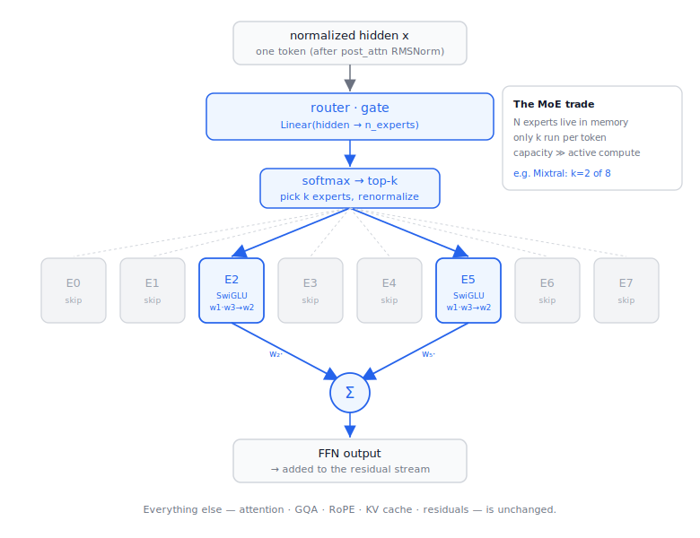

# Mixture-of-Experts (MoE)

> How MoE extends the decoder-only model in `causalLM-architecture.md`. The one
> idea to hold onto: **MoE changes only the feed-forward block. Attention, GQA,
> RoPE, the KV cache, RMSNorm, and the residual stream are all identical.**



Implemented in `hf-model-inference/src/model.py` as `MoEMLP` + `Expert`, used by
`DecoderLayer` whenever the config is MoE (`expert_count > 0`).

---

## 1. Dense FFN vs MoE FFN

**Dense (what every Llama/Qwen layer has):** one SwiGLU MLP; every token goes
through it.

```python
mlp(x) = down( silu(gate(x)) * up(x) )
```

**MoE:** `N` expert MLPs (each one *is* a SwiGLU MLP) plus a small **router**.
Per token, the router picks the **top-k** experts, runs only those, and combines
their outputs weighted by the router probabilities.

```python
scores = softmax(gate(x))              # gate: Linear(hidden, N)
w, idx = scores.topk(k)                # choose k of N experts
w = w / w.sum()                        # renormalize the k weights
out  = Σ  w_e · expert_e(x)            # run only the chosen experts
```

That's the whole difference. With `N = 8, k = 2`, a token touches 2 experts, not
8 — and not the 1 dense MLP either, but 2 *small* ones.

---

## 2. The one big idea: capacity decoupled from compute

MoE lets you grow parameters without growing per-token FLOPs:

- **Parameters (memory): large.** All `N` experts must sit in VRAM — any token might route to any of them.
- **Active compute per token: small.** Only `k` experts run.

So a Mixtral-8x7B holds ~47B parameters but runs at roughly the speed of a ~13B
dense model. You pay in **memory** to buy **capacity**, while keeping inference
**FLOPs** low. This is the central reason MoE dominates the frontier — and also
why MoE is memory-hungry to *serve* even though it's cheap to *run*.

| | Dense 13B | Mixtral 8x7B (MoE) |
|---|---|---|
| Total params | ~13B | ~47B |
| Active params / token | ~13B | ~13B |
| VRAM for weights | ~13B worth | ~47B worth |
| Speed | baseline | ≈ same as 13B dense |

---

## 3. Routing details that matter

- **Per token, per layer.** Routing is independent everywhere — the same token can use experts {2,5} in one layer and {0,7} in the next.
- **Softmax then top-k** (Mixtral order): softmax over *all* experts, take the top-k, then **renormalize** those k weights so they sum to 1. Our `MoEMLP` does exactly this; verified against an independent reference to 0.0 error.
- **Loop over experts, not tokens.** The efficient pattern (and what `MoEMLP.forward` does): for each expert, gather the tokens routed to it, run the expert once on that batch, scatter the weighted result back. Never run every token through every expert.
- **Load balancing is a training concern.** During training an auxiliary loss keeps experts evenly used; at **inference** you just route to the top-k and ignore balancing.

---

## 4. Variants you'll encounter

- **Shared experts** (DeepSeek-MoE, Qwen-MoE): one or more always-on experts run for *every* token, alongside the routed top-k. Captures common computation so the routed experts can specialize.
- **Fine-grained experts:** many small experts (e.g. 64) with a larger k, instead of few big ones.
- **Per-expert FFN size** (`moe_intermediate_size`): some families make each expert narrower than a dense MLP would be. Our `config.expert_ffn` handles this (falls back to `intermediate_size`, which is what Mixtral uses).

This implementation targets the **Mixtral** layout (uniform MoE every layer, no
shared expert). Qwen-MoE adds shared experts and a different naming scheme; it
would be a follow-on.

---

## 5. Weight layout (why names matter)

We mirror Mixtral's checkpoint names so `load_state_dict` works with no remapping:

| Our module | Checkpoint key |
|---|---|
| `block_sparse_moe.gate` | `model.layers.N.block_sparse_moe.gate.weight` (router) |
| `block_sparse_moe.experts.{e}.w1` | `...experts.{e}.w1.weight` (gate proj) |
| `block_sparse_moe.experts.{e}.w3` | `...experts.{e}.w3.weight` (up proj) |
| `block_sparse_moe.experts.{e}.w2` | `...experts.{e}.w2.weight` (down proj) |

`DecoderLayer` names the FFN attribute `block_sparse_moe` for MoE models and
`mlp` for dense ones, so the same `model.py` loads both straight from the
checkpoint.

(In GGUF, the equivalent tensor names are `ffn_gate_inp` for the router and
`ffn_{gate,up,down}_exp` for the experts — see `gguf-format.md`.)

---

## 6. Config fields

Read by `config.py`:

| config.json | ModelConfig | meaning |
|---|---|---|
| `num_local_experts` / `num_experts` | `expert_count` (N) | total experts |
| `num_experts_per_tok` | `expert_used_count` (k) | experts run per token |
| `moe_intermediate_size` | `expert_intermediate_size` | per-expert FFN width (optional) |

`expert_count == 0` ⇒ dense model ⇒ the old `MLP` path. No flag needed; the
presence of experts in the config switches the model into MoE mode.

---

## 7. Running it

MoE models are large (Mixtral-8x7B ≈ 47B params — too big for a laptop). For
verifying the code path runs end-to-end, use a tiny random-weight MoE fixture
(e.g. a `*tiny*MixtralForCausalLM` test model on the Hub) — output is gibberish
(random weights) but it exercises routing, expert dispatch, and weight loading:

```bash
python tools/download_model.py <tiny-mixtral-repo>
python hf-model-inference/src/run.py --model models/<tiny-mixtral> --prompt "hi" --no-chat
```

For real quality you'd need the full weights on a machine with enough VRAM. The
*architecture* is the lesson here; the structure is identical whether the experts
are tiny test tensors or a 47B checkpoint.

---

### Notes

- MoE is a drop-in replacement for the FFN — the cleanest possible "new architecture" because it reuses your entire attention + cache stack.
- Next variants worth adding: shared experts (Qwen-MoE/DeepSeek), then a genuinely different paradigm like Mamba (no attention, no KV cache).
