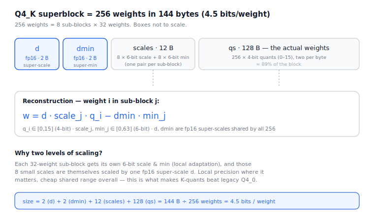

# Quantization (GGUF)

> Quantization is most of a GGUF file — the weights *are* the model, and
> quantization is how they shrink. This doc covers (a) the core idea + families,
> (b) a byte-by-byte walk of one format (Q4_K), and (c) how to pick a quant.
> Companion to `gguf-format.md` §6.

---

## 1. Why quantize, and the core trick

Weights are normally fp16/bf16 — **2 bytes each**. A 7B model is ~14 GB before
you've loaded anything else. Quantization stores each weight in **fewer bits**
(8, 5, 4, even 2–3), cutting file size and VRAM proportionally.

The trick: within a small group, weights cluster in a narrow range. So instead
of storing each value, store **low-bit integers + a shared scale**, and
reconstruct on the fly:

```
w ≈ scale · q            (symmetric — Q4_0)
w ≈ scale · q + min      (asymmetric — Q4_1, K-quants)
```

A 4-bit `q` (0–15) plus one fp16 scale per block of 32 weights takes you from 16
bits/weight to ~4.5 — a ~3.5× shrink.

**Why per-block, not per-tensor:** one scale for a whole matrix would let a few
outlier weights stretch the range and crush everyone else's precision.
Quantizing in **blocks** (32 or 256 weights) lets each block adapt locally. This
localization is the entire reason low-bit quantization works.

---

## 2. The GGUF quant families

| Family | Examples | Block | Idea |
|---|---|---|---|
| **Legacy** | `Q4_0, Q4_1, Q5_0, Q8_0` | 32 | one scale (+ optional min) per block |
| **K-quants** | `Q2_K … Q6_K` | 256 superblock | two-level scaling, sub-block scales |
| **IQ** | `IQ2_XXS … IQ4_XS` | 256 | importance-matrix; bits where they matter |

- **Legacy** is simple and a bit wasteful.
- **K-quants** add a second level of scaling (below) — better quality per bit, the modern default.
- **IQ / imatrix** quants use a calibration dataset to find which weights *matter* and spend bits accordingly — the only way to stay usable at 2–3 bits.

**The `_S` / `_M` / `_L` suffixes are mixed precision, not a quant type.**
`Q4_K_M` keeps the *sensitive* tensors at higher precision — typically `attn_v`,
`ffn_down`, the output head, sometimes embeddings — and the rest at 4-bit. Some
layers hurt accuracy far more than others when squeezed, so bits are spent
unevenly. That's why `Q4_K_M` is the famous sweet spot, not uniform 4-bit.

---

## 3. (a) A Q4_K superblock, byte by byte



A `Q4_K` superblock holds **256 weights in 144 bytes** (= 4.5 bits/weight),
arranged as:

| Field | Bytes | Meaning |
|---|---|---|
| `d` | 2 (fp16) | super-scale — multiplies all sub-block scales |
| `dmin` | 2 (fp16) | super-min — multiplies all sub-block mins |
| `scales` | 12 | 8 × 6-bit scales **and** 8 × 6-bit mins, bit-packed |
| `qs` | 128 | 256 × 4-bit quants (two per byte) — the actual weights |

`2 + 2 + 12 + 128 = 144 bytes ÷ 256 = 4.5 bpw`.

The 256 weights are split into **8 sub-blocks of 32**. Each sub-block `j` has its
own 6-bit `scale_j` and 6-bit `min_j`. Reconstruction for weight `i` in sub-block
`j`:

```
w = d · scale_j · q_i  −  dmin · min_j
```

So there are **two levels**: each sub-block adapts locally with its own 6-bit
scale/min, and those 8 small scales are themselves scaled by the single fp16
super-scale `d` (mins by `dmin`). Local precision where it matters, one cheap
shared range overall — this is exactly why K-quants beat legacy Q4_0 at the same
size.

**The 12-byte scales packing** is the fiddly part — 8 scales + 8 mins, each
6-bit, = 96 bits = 12 bytes, packed by `get_scale_min_k4` in ggml:

```c
// q = the 12 scale bytes, j = sub-block 0..7
if (j < 4) {
    scale = q[j]     & 63;          // low 6 bits
    min   = q[j + 4] & 63;
} else {
    scale = (q[j+4] & 0xF) | ((q[j-4] >> 6) << 4);   // 4 low bits + 2 high bits
    min   = (q[j+4] >>  4) | ((q[j]   >> 6) << 4);
}
```

The first four sub-blocks store their 6-bit scale/min directly in the low bits of
bytes 0–7; the last four reuse the **top 2 bits** of those same bytes plus bytes
8–11. It's ugly, but it squeezes sixteen 6-bit values into 12 bytes with no
waste. (`Q6_K`, `Q5_K`, `Q3_K`, `Q2_K` follow the same superblock pattern with
different bit widths.)

**Where the bytes go** (the 89% that is `qs`) is the lesson: the scales are
overhead; almost everything is the 4-bit weights themselves. That's why bpw is
dominated by the quant width, not the scaling scheme.

---

## 4. (b) Picking a quant: quality vs size

### The size math

```
file_size ≈ total_params × bits_per_weight ÷ 8
VRAM_needed ≈ file_size + KV_cache + activation/context overhead
```

So a 7B model: `7e9 × 4.5 / 8 ≈ 3.9 GB` at Q4_K_M, vs ~14 GB at fp16.

### The quality curve (bits/weight → quality)

| Quant | bpw | Quality | Use when |
|---|---|---|---|
| `Q8_0` | ~8.5 | ~lossless | small models, or you have room |
| `Q6_K` | ~6.6 | near-lossless | quality-sensitive |
| `Q5_K_M` | ~5.5 | excellent | comfortable headroom |
| **`Q4_K_M`** | ~4.5 | **negligible loss for chat** | **default sweet spot** |
| `Q3_K_M` / `IQ3` | ~3.4 | noticeable but usable | tight VRAM |
| `Q2_K` / `IQ2` | ~2.5 | real degradation | last resort to fit a big model |

### The decision, in practice

1. **Find your VRAM budget**, subtract room for KV cache + context (can be GBs at long context).
2. **Pick the largest quant that fits** — more bits is always better quality. Don't run Q2 if Q4 fits.
3. **Default to `Q4_K_M`.** It's the consensus best size/quality tradeoff.
4. **Stay at 4-bit or above if you can.** Quality falls off a cliff below ~3 bpw.
5. **Prefer imatrix (`IQ*`) builds for low bit** — at 2–3 bpw an importance-matrix quant clearly beats a plain one.

### Model size changes the calculus

**Bigger models tolerate aggressive quantization better.** A 70B at Q2_K often
beats a 13B at Q8 on the same VRAM, because the larger model has redundancy to
spare. A 1–3B model, by contrast, degrades noticeably even at Q4 — small models
want more bits. So the right quant depends on *both* your VRAM and the model's
size: with a fixed budget, "bigger model, lower bits" usually wins down to ~4-bit.

---

## 5. (c) The bigger picture

- **Dequantization happens in-kernel.** The GPU never holds these as floats — each matmul unpacks a block back to floats *inside* the kernel, multiplies, discards. So quantization is fundamentally a **storage + memory-bandwidth** optimization, not a compute one.
- **…but it speeds up decode anyway.** Token-by-token generation is memory-bandwidth-bound (you stream every weight per token). Moving 4× less data makes decode faster almost for free.
- **What stays unquantized:** RMSNorm weights, biases, and often the embedding/output at higher precision. The quant targets the big `Linear` matrices, ~99% of the bytes.
- **Weight-only, not activation.** GGUF quantizes *weights*; activations are computed in fp16/fp32 at runtime. This is different from `W8A8`-style schemes (server stacks) that also quantize activations to int8 for faster *compute*. GGUF optimizes memory; activation quant optimizes compute. Different goals.
- **Quantization is lossy and one-way.** You quantize from the fp16 checkpoint once (`llama-quantize`); you can't recover the original. Quality is set at quant time.

---

## 6. How this connects to our code

Our `hf-model-inference/` runs **full precision only** — no dequantization path.
That's deliberate (readable first), and it's why a 7B needs ~14 GB to run there.
Supporting GGUF/quantized weights would mean:

1. A GGUF reader (parse header + tensor table per `gguf-format.md`).
2. Per-format block dequantization (e.g. the `Q4_K` reconstruction above) — either eagerly to fp16 on load, or lazily per matmul.
3. Mapping GGUF tensor names (`blk.N.attn_q.weight`, `ffn_gate_inp`, …) to our modules.

That's a natural future milestone — it's the bridge from "understand the format"
(`gguf-format.md`) and "understand the math" (this doc) to actually loading a
`.gguf` and getting tokens out.

---

## 7. Quantizing a model (the forward direction) & its hard problems

The docs above are mostly about *reading* quantized weights. This section records
the *making* of them — why it ranges from trivial to a research problem — so we
can pick it up later.

### 7.1 The easy part — round-to-nearest (RTN)

Basic block quantization is genuinely simple, a single data-free pass:

```
scale = max(abs(block)) / max_int          # symmetric, e.g. /7 for int4
q     = round(block / scale)               # store these low-bit ints
# dequant: w ≈ scale · q
```

`Q4_0` / `Q8_0` are essentially this. The forward quantizer is the mirror of the
dequant code and is ~15 lines. **For these formats, quantization is not hard.**

### 7.2 Why "good" quantization is hard — the core ideas

The difficulty is keeping quality at low bits. The mental model:

- **A block compresses well when its *range* is bounded** (not when values are
  "close" — bounded spread is enough). Error ∝ `range / number_of_levels`. You
  can always quantize; accuracy depends on range vs level count.
- **`scale` sets the step size; `min` sets where the range starts.** Symmetric
  (scale only) assumes values straddle zero; **asymmetric (scale + min)** slides
  the "ruler" onto an offset range (e.g. all-positive blocks) so all 16 levels
  are used. That's why Q4_1 / K-quants carry a `min`, while Q4_0/Q5_0/Q8_0 don't.
- **Block size is a knob — overhead vs precision.** Smaller block → tighter range
  → finer levels, but more scales stored. Larger block → less overhead, coarser
  levels. K-quants resolve this with **two-level scaling**: a 256 superblock (low
  overhead) subdivided into 32-wide sub-blocks each with its own scale (local
  precision). Most quant schemes are just different answers to "how big is the
  block, and how many levels of scaling."
- **"Find the sweet scale" is a per-block optimization**, not `max/min`. ggml
  searches for the scale that minimizes reconstruction error (MSE), which usually
  isn't the range-covering one.

### 7.3 The outlier problem & the five tools

An outlier in a block forces a lose-lose choice when picking the scale:

- **Stretch** the range to include it → big scale → all normal values get coarse.
- **Clip** it → tight scale for normal values → the outlier saturates (big error on one).

Every technique is a smarter answer to this. From cheap to fancy:

1. **Smaller / nested blocks** — isolate the outlier so it only degrades its own
   sub-block (K-quants' two-level scaling).
2. **MSE-optimal scale** — the scale search often *clips* the outlier on purpose,
   since sacrificing one value to keep 31 precise is lower total error.
3. **Mixed precision** — give reliably-sensitive tensors more bits (token embed,
   output head, `attn_v`, `ffn_down`). The `_S/_M/_L` schemes. (Our Qwen Q4_K_M
   stored `token_embd` as Q5_0 for exactly this reason.)
4. **Calibration-based protection** (§7.4) — use data to protect the outliers
   that actually matter.
5. **Decomposition** — keep the few genuine outlier dimensions in fp16, quantize
   the rest (LLM.int8()-style).

### 7.4 Calibration-based methods (the heavy hitters)

When low bits really matter, you run the model on sample data to learn which
weights/channels are important, then protect them:

- **imatrix** (makes GGUF's IQ2/IQ3 usable) — an *importance matrix* from
  calibration activations weights the quantization error, so unimportant outliers
  can be sacrificed and important values protected.
- **GPTQ** — quantize weights one at a time and **adjust the remaining weights** to
  compensate, using second-order (Hessian) info from calibration data.
- **AWQ** — find salient channels by activation magnitude and **scale them up**
  before quantizing so they survive.
- **SmoothQuant** — migrate outlier "difficulty" from activations into weights via
  a per-channel smoothing scale (needed when activations are also quantized).

These need data + forward passes — not data-free, not a five-line loop.

### 7.5 Weight-only vs activation quantization

- **GGUF / llama.cpp is weight-only** — activations stay fp16/fp32 at runtime. This
  sidesteps the *worst* outliers in LLMs, which live in **activations**, not
  weights. GGUF only has to solve weight-block outliers (§7.3).
- **W8A8 schemes** (server stacks) quantize activations too, for faster *compute* —
  and must use SmoothQuant-style tricks to tame activation outliers first.
- So: GGUF optimizes **memory**; activation quant optimizes **compute**.

### 7.6 Open problems / where to dig later

- Writing a forward quantizer for `Q8_0`/`Q4_0` (easy) → then `Q4_K`'s scale search
  (much fiddlier) — a good way to *feel* the difference.
- Implementing an imatrix pass (run calibration text, accumulate activation
  importance, weight the error).
- Sub-3-bit (IQ2/IQ3) — where calibration stops being optional.
- Activation quantization + SmoothQuant — the compute-side story GGUF skips.

---

### Notes

- Quant *type* (Q4_K) is recorded per-tensor in GGUF; the dominant one is summarized in `general.file_type`.
- `general.quantization_version` tracks the format version separately from the scheme name.
- Numbers here (block sizes, bpw) are from the ggml implementation conventions; see `gguf-format.md` for the spec-level detail.
