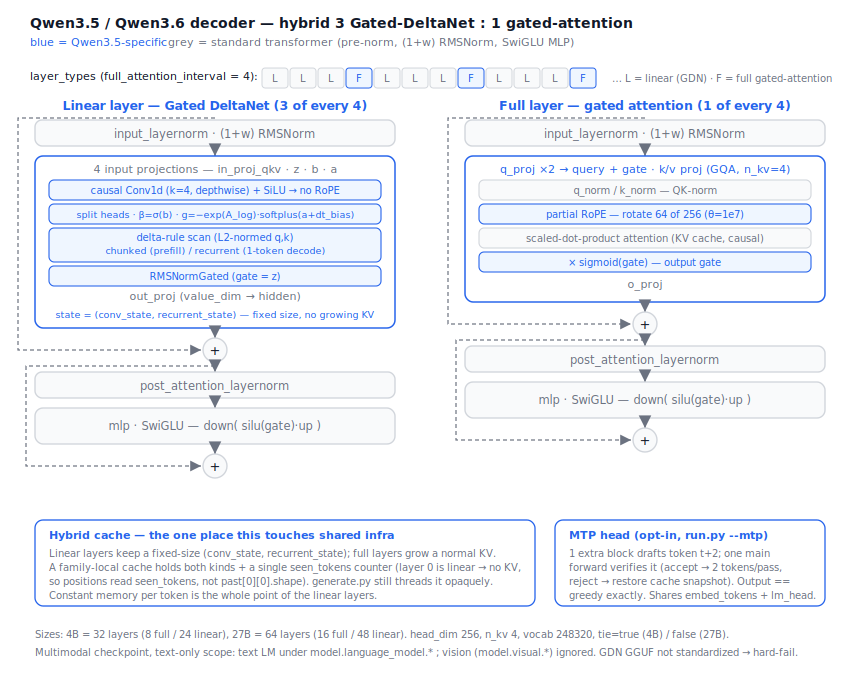

# Qwen3.5 / Qwen3.6 — architecture & implementation plan (`qwen3_5` family)

> Design doc for adding a `qwen3_5/` family. Grounded in the **real configs**
> (`Qwen/Qwen3.5-4B`, `Qwen/Qwen3.6-27B`) and the **transformers reference** for the
> Gated DeltaNet lineage (`modeling_qwen3_next.py` — Qwen3.5's text stack is the same
> lineage per Qwen's own writeups). Where Qwen3.5 *might* diverge from Qwen3-Next, it's
> called out under "Deltas to confirm." Nothing here is implemented yet; per the vision
> we write the spec first, then port from the reference and gate with `compare_logits.py`.



## TL;DR

- **One family handles both.** `Qwen3.5-4B` and `Qwen3.6-27B` share
  `model_type: "qwen3_5"` and `architectures: ["Qwen3_5ForConditionalGeneration"]`.
  All differences are config fields (sizes, `output_gate_type`, `tie_word_embeddings`).
  → Build `qwen3_5/`, register it for both, **no separate `qwen3.6/` folder.**
- **"Dense" is misleading.** These are **hybrid** decoders: a repeating block of
  **3 Gated DeltaNet (linear-attention) layers : 1 gated full-attention layer**
  (`full_attention_interval: 4`). Not a plain transformer like `qwen3/`.
- **Multimodal model, text-only scope.** The checkpoint is a VL model
  (`Qwen3_5ForConditionalGeneration` + `vision_config`); we implement the `qwen3_5_text`
  LM only.
- **PyTorch-only is feasible.** The reference has pure-torch fallbacks for the conv and
  the delta-rule scan — we port those (readable, run on MPS/CPU), not the CUDA/FLA kernels.
- **The hard part for our engine** is the cache: linear layers keep a fixed-size
  `(conv_state, recurrent_state)`, not a growing KV cache. This stays *inside* the
  family, but the shared loop's `past_len` probe needs a small generalization.

## Sizes (from the real configs)

| field | Qwen3.5-4B | Qwen3.6-27B |
|---|---|---|
| `hidden_size` | 2560 | 5120 |
| `intermediate_size` | 9216 | 17408 |
| `num_hidden_layers` | 32 | 64 |
| `num_attention_heads` | 16 | 24 |
| `num_key_value_heads` | 4 | 4 |
| `head_dim` | 256 | 256 |
| `linear_num_key_heads` | 16 | 16 |
| `linear_num_value_heads` | 32 | 48 |
| `linear_key_head_dim` | 128 | 128 |
| `linear_value_head_dim` | 128 | 128 |
| `linear_conv_kernel_dim` | 4 | 4 |
| `full_attention_interval` | 4 | 4 |
| `rope_theta` | 10_000_000 | 10_000_000 |
| `partial_rotary_factor` | 0.25 | 0.25 |
| `rms_norm_eps` | 1e-6 | 1e-6 |
| `vocab_size` | 248320 | 248320 |
| `attn_output_gate` | true | true |
| `output_gate_type` | (default) | `swish` |
| `tie_word_embeddings` | true | false |
| `mtp_num_hidden_layers` | 1 | 1 |

`layer_types` is the literal per-layer schedule in the config: indices `3, 7, 11, …`
(every 4th, 0-based `i % 4 == 3`) are `full_attention`; the rest are `linear_attention`.

Derived dims (4B, the parity target):
- full attention: `q_proj → 16·256·2 = 8192` (query **and** an output gate, hence ×2),
  `k_proj = v_proj → 4·256 = 1024`, `o_proj in = 16·256 = 4096`.
- linear (GDN): `key_dim = 128·16 = 2048`, `value_dim = 128·32 = 4096`,
  `conv_dim = 2·key_dim + value_dim = 8192`, `in_proj_qkvz → 2·key_dim + 2·value_dim = 12288`,
  `in_proj_ba → 2·num_v_heads = 64`, value/key head ratio `num_v_heads/num_k_heads = 2`.

## Components

All norms are **`Qwen3NextRMSNorm`**: zero-init weight, computed in fp32, scaled by
`(1 + weight)` — i.e. the **same "+1" convention as Gemma** (relevant for any future GGUF
path, and a nice reuse of intuition from `gemma2/`). A second variant,
**`RMSNormGated`** (ones-init), normalizes then multiplies by `silu(gate)`; it's used
only *inside* the GDN output.

### Decoder layer (pre-norm, standard residual — not sandwich)

```
residual = x
x = input_layernorm(x)
x = token_mixer(x)                 # linear_attn  OR  self_attn, per layer_types[i]
x = residual + x
residual = x
x = post_attention_layernorm(x)
x = mlp(x)                         # SwiGLU dense MLP (no MoE in 4B/27B)
x = residual + x
```

Same two-norm pre-norm shape as `qwen2/`; the novelty is entirely in the two token mixers.

### Full-attention layer — `Qwen3NextAttention` (gated)

Differences vs our `qwen3/` attention:
1. **Output gate.** `q_proj` emits `2 · n_head · head_dim`; split into `query` and a
   `gate`. After attention: `attn_output = attn_output * sigmoid(gate)` before `o_proj`.
   (Qwen3.6 sets `output_gate_type: "swish"` — see Deltas; sigmoid is the Qwen3-Next default.)
2. **QK-norm** on `head_dim` (RMSNorm), like `qwen3/`.
3. **Partial RoPE.** Only the first `head_dim · partial_rotary_factor = 256·0.25 = 64`
   dims are rotated; the remaining 192 pass through unrotated (`apply_rotary_pos_emb`
   splits `q_rot|q_pass`).
4. GQA (`n_kv = 4`), scale `head_dim**-0.5`, causal. Standard KV cache.

### Linear-attention layer — `Qwen3NextGatedDeltaNet` (the core novelty)

Token mixer with **no softmax and no growing KV cache** — it carries a fixed-size
recurrent state. Numbered forward (port of the pure-torch reference path):

1. **Project (Qwen3.5 layout — four separate linears, confirmed from the checkpoint).**
   `in_proj_qkv(x) → cat(q,k,v)` (size `conv_dim`), `in_proj_z(x) → z` (output gate, size
   `value_dim`), `in_proj_b(x) → b`, `in_proj_a(x) → a` (each `num_v_heads`). (Qwen3-Next
   instead packs these as `in_proj_qkvz`/`in_proj_ba` + a reshuffle — Qwen3.5 split them.)
2. **Causal depthwise Conv1d** over `cat(q, k, v)` (channels = `conv_dim`, kernel 4,
   `groups = conv_dim`, left-padded so it's causal), then SiLU. This is the local
   "positional" mixer (GDN uses no RoPE). The conv's last `kernel-1` columns are the
   per-step **conv_state** cache.
3. **Split** back into `q, k, v`; reshape to heads (`head_k_dim=128`, `head_v_dim=128`).
   If `num_v_heads > num_k_heads`, `repeat_interleave` q,k to match v heads.
4. **Gating terms.** `beta = sigmoid(b)`; `g = -exp(A_log) · softplus(a + dt_bias)`
   (per-value-head decay; `A_log`, `dt_bias` are learned `(num_v_heads,)` vectors).
5. **Delta-rule scan** with L2-normalized q/k (`use_qk_l2norm_in_kernel=True`):
   - prefill / multi-token → `torch_chunk_gated_delta_rule` (chunked, default chunk 64),
   - cached single-token decode → `torch_recurrent_gated_delta_rule` (one step),
   both reading/writing `recurrent_state` shape `(B, num_v_heads, head_k_dim, head_v_dim)`.
6. **Gated output norm.** `RMSNormGated(head_v_dim)(core_attn_out, gate=z)`, then
   `out_proj(value_dim → hidden)`.

The delta rule = error-correcting associative memory: each step writes
`k ⊗ (v − ⟨state,k⟩)·β` into the state (decayed by `exp(g)`) and reads `⟨state, q⟩`.
`torch_recurrent_gated_delta_rule` is the cleanest place to *read* this; the chunked
version is the same math reorganized for parallel prefill.

### MLP

Plain SwiGLU: `down(silu(gate(x)) · up(x))` — identical to `qwen2/qwen3`. (The big
MoE variants add a `SparseMoeBlock`; the 4B/27B configs have no experts, so dense MLP
everywhere. We implement dense only.)

## Cache contract — the one place this touches shared infra

`generate.py` is fine: it threads an **opaque** `past` through and never inspects it.
The snag is the position counter, today computed in each family's `forward` as
`past[0][0].shape[2]`. In `qwen3_5`, **layer 0 is a linear layer with no KV**, so that
probe is invalid.

Plan — keep it inside the family:
- Define a small family-local cache object holding, per layer, either a KV tuple
  (full layers) or a `(conv_state, recurrent_state)` pair (linear layers), plus a single
  scalar `seen_tokens`.
- The model's `forward` reads `seen_tokens` for positions instead of `past[0][0]`.
- `generate.py` still just passes the object back in — **no shared change**. (If we'd
  rather not special-case, we could add an optional `past_len` out-param to the
  `forward` contract, but the family-local counter is simpler and self-contained.)

State shapes (per linear layer): `conv_state (B, conv_dim, kernel-1=3)`,
`recurrent_state (B, num_v_heads, head_k_dim, head_v_dim)`. Both fixed-size → constant
memory per token (the whole point of linear attention).

## Positional encoding — partial RoPE + mRoPE

- **Partial RoPE** (above): rotate 64 of 256 head dims, `theta = 1e7`.
- **mRoPE** (`rope_parameters.mrope_interleaved`, `mrope_section [11,11,10]`) is the
  *multimodal* 3-axis rope (text/height/width). **For text-only input, position_ids are
  1-D and all three sections share the same position, so it reduces to standard partial
  RoPE.** We implement the text reduction and note the multimodal path as out of scope.

## MTP head (in scope per request)

The checkpoint ships a **multi-token-prediction** head (`mtp_num_hidden_layers: 1`,
`mtp_use_dedicated_embeddings: false`). The CausalLM ignores it
(`_keys_to_ignore_on_load_unexpected = [r"^mtp.*", r"^model.visual.*"]`), so it's **not
needed for correct next-token generation** — but the checkpoint index reveals its exact
structure (Eagle/MTP-style speculative head):

```
mtp.pre_fc_norm_embedding.weight     # norm the next-token embedding
mtp.pre_fc_norm_hidden.weight        # norm the previous hidden state
mtp.fc.weight                        # fc: combine [emb ; hidden] → hidden
mtp.layers.0.{input_layernorm,post_attention_layernorm}.weight
mtp.layers.0.self_attn.{q,k,v,o}_proj.weight + {q_norm,k_norm}.weight   # one full-attn block
mtp.layers.0.mlp.{gate,up,down}_proj.weight
mtp.norm.weight                      # final norm before the (shared) lm_head
```

Shape: it reuses the main `embed_tokens` (`mtp_use_dedicated_embeddings: false`) and the
shared `lm_head`. To predict token *t+2*: norm the previous hidden state and the *t+1*
token embedding, concat → `fc` → one decoder layer → `mtp.norm` → `lm_head`.

→ Plan executed: base LM landed and parity-passed first; MTP added as the opt-in step-6
module (`mtp.py`, top-level `mtp.*` weights, shared embeddings + lm_head). It is wired into
inference behind `run.py --mtp` as self-speculative decoding: the head drafts token t+2,
one batched main forward over `[pending, draft]` verifies it (accept → 2 tokens for ~1
pass; reject → restore the pre-verify cache snapshot and re-run the one confirmed token).
The cache snapshot is needed because the GDN `(conv, recurrent)` state is not invertible —
unlike a KV cache, it can't be sliced back a token. Output equals greedy decoding exactly
(a draft is accepted only when it matches the main model's own next token).

**Caveat:** no `transformers` class implements MTP (every variant lists `mtp.*` as
ignored), so there is no reference to numerically parity-check the head — it matches the
checkpoint's tensor layout and follows the documented Eagle forward, validated structurally
(loads, runs, right shapes). Two details a reference would pin down — the `fc` concat order
`[emb ; hidden]` and the MTP block's position offset — follow the doc/Eagle convention; the
verify loop makes the position offset moot (a bad draft is simply rejected). The MTP
attention is assumed **gated** (q_proj ×2), consistent with the main full-attention block;
if a real checkpoint's `mtp.layers.0.self_attn.q_proj` is un-gated, the loader fails loud
on a shape mismatch.

## Tensor names (confirmed from `Qwen/Qwen3.5-4B` index)

The checkpoint is the **multimodal** model, so the text LM lives under
`model.language_model.*` (vision is `model.visual.*`, ignored). Our modeling keeps the
clean `model.*` names and `weights.to_raw` rewrites the prefix `model. → model.language_model.`
(the "family owns the name map" seam). `lm_head.weight` stays top-level.

```
model.language_model.embed_tokens.weight
model.language_model.norm.weight
model.language_model.layers.{i}.input_layernorm.weight
model.language_model.layers.{i}.post_attention_layernorm.weight
model.language_model.layers.{i}.mlp.{gate_proj,up_proj,down_proj}.weight
# full-attention layers (i % 4 == 3)
model.language_model.layers.{i}.self_attn.{q_proj,k_proj,v_proj,o_proj}.weight
model.language_model.layers.{i}.self_attn.{q_norm,k_norm}.weight
# linear-attention layers (else) — Qwen3.5's FOUR input projections
model.language_model.layers.{i}.linear_attn.in_proj_qkv.weight    # → conv_dim
model.language_model.layers.{i}.linear_attn.in_proj_z.weight      # → value_dim (gate)
model.language_model.layers.{i}.linear_attn.in_proj_b.weight      # → num_v_heads
model.language_model.layers.{i}.linear_attn.in_proj_a.weight      # → num_v_heads
model.language_model.layers.{i}.linear_attn.conv1d.weight         # depthwise, bias=False
model.language_model.layers.{i}.linear_attn.A_log                 # (num_v_heads,)
model.language_model.layers.{i}.linear_attn.dt_bias              # (num_v_heads,)
model.language_model.layers.{i}.linear_attn.norm.weight           # RMSNormGated
model.language_model.layers.{i}.linear_attn.out_proj.weight
# head
lm_head.weight        # absent when tied (4B); present in 27B (tie=false)
mtp.*                 # multi-token-prediction head (see below) — ignored for base LM
model.visual.*        # vision tower — ignored (text-only engine)
```

No GGUF path planned (GDN GGUF is not standardized — hard-fail).

## Family package layout (`src/qwen3_5/`)

```
__init__.py            MODEL_TYPES = ["qwen3_5"] · DEFAULTS · register(load)
config.py              Qwen3_5Config (incl. layer_types, linear_* dims, partial_rotary, output_gate_type, tie)
blocks.py              RMSNorm(+1) · RMSNormGated · partial-RoPE · GatedAttention · GatedDeltaNet · MLP
                       + l2norm, torch_causal_conv1d_update, torch_chunk/recurrent_gated_delta_rule
modeling_qwen3_5.py    DecoderLayer (dispatch on layer_types) · Qwen3_5Model · forward (+ family cache)
weights.py             identity HF name map + streaming load (handles A_log/dt_bias/conv1d/norm)
README.md              the per-family notes (this doc's condensed form)
```

`blocks.py` will be larger than other families' (GDN is genuinely more code) but stays
pure PyTorch and readable — we port the reference's `torch_*` fallbacks verbatim-ish,
with our numbered-step narration.

## Validation plan

- `compare_logits.py` against `transformers` `Qwen3_5ForConditionalGeneration` (text
  branch) on `Qwen/Qwen3.5-4B`, fp32 on CPU. Gate on argmax + cosine ≈ 1, per the vision.
- **MPS caveat:** the reference's *fast* path needs `causal_conv1d` + `flash-linear-attention`
  (CUDA-only). Our port uses the pure-torch fallbacks, so *our* model runs on MPS/CPU — but
  the **reference** may also fall back to torch on CPU; run the parity check on CPU to keep
  both on the same path.
- Sanity checks before parity: per-layer shape asserts (the GDN reshapes are fiddly),
  conv causality (output at t doesn't depend on t+1), and recurrent-vs-chunked agreement
  (the two delta-rule paths must match on the same input).

## Deltas — resolved against `modular_qwen3_5.py` + the 4B checkpoint index

Confirmed (no longer open):

1. **Full attention** → output gate is `torch.sigmoid(gate)`, **for both 4B and 27B**.
   Resolved against the real `Qwen/Qwen3.6-27B` config + transformers 4.57.1: the reference
   `Qwen3_5Attention.forward` hardcodes `sigmoid` and `output_gate_type` appears **nowhere**
   in the modeling or config code — the 27B's `"swish"` value is silently ignored. So we
   hardcode sigmoid too (an earlier config-driven `silu`-for-`swish` would have *diverged*
   from the reference on 27B). `output_gate_type` is still parsed but unused.
2. **GDN projections** = four linears (`in_proj_qkv/z/b/a`) — implemented; matches the
   reference `Qwen3_5GatedDeltaNet` line-for-line (split `[key,key,value]`, `beta=σ(b)`,
   `g=-exp(A_log)·softplus(a+dt_bias)`, l2-normed q/k, gated output norm).
3. **Tensor prefix** = `model.language_model.*` — handled in `to_raw`.
4. **MTP** structure — known (see MTP section).
5. **mRoPE text reduction** — **confirmed.** For 1-D (text) position_ids the reference
   builds all three rope axes from the *same* positions, so `apply_interleaved_mrope`
   returns the plain `freqs[0]`: standard partial RoPE, `inv_freq = 1/θ^(arange(0,d,2)/d)`,
   `attention_scaling = 1.0`. Our `RoPE` matches exactly.

6. **Qwen3.6-27B is the same family** — verified against the real config. `model_type:
   "qwen3_5"`, `Qwen3_5ForConditionalGeneration`, same hybrid schedule (64 layers → 16 full
   / 48 linear, `full_attention_interval: 4`), same GDN dims / partial-RoPE / MTP. Only
   differences are sizes, `tie_word_embeddings: false` (untied), and `output_gate_type:
   "swish"` (ignored, see #1). No new architecture, no MoE — our config-driven code handles
   it (e.g. `v_per_k = 48/16 = 3` vs the 4B's 2, applied generically).
7. **27B `lm_head.weight`** = **top-level** (untied). The reference ties it as
   `lm_head.weight → model.language_model.embed_tokens.weight`, i.e. `lm_head` is a sibling
   of `model`. Our `to_raw` already leaves `lm_head.weight` top-level, and `weights.load`
   detects the untied case by its presence in the checkpoint — so 27B loads without changes.

## Build order (once this doc is approved)

1. `config.py` + `__init__.py` + name map; load weights, assert shapes (no forward yet).
2. Full-attention layer + MLP + the layer dispatch; stub linear layer.
3. Gated DeltaNet (conv + chunked + recurrent), the bulk of the work.
4. Family cache + position counter; wire `forward`.
5. `compare_logits` parity on Qwen3.5-4B (CPU/fp32) → iterate to cosine ≈ 1.
6. (Separate) MTP head once its structure is confirmed.
